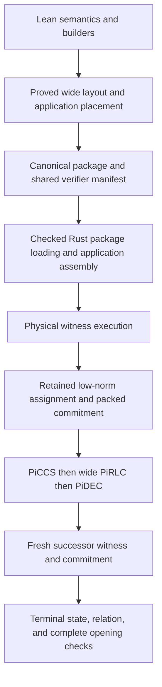

# PR #123: current-head review and commit record

Review date: 26 September 2026.

**Decision: request changes to meet the stated cleanup goal.** The final Rust path uses the wide sampler and one package, application, and witness route. The main runtime duplication from the earlier commits is removed. The Lean path still carries the retired bounded sampler and its baseline proof owners. Some executable tests and tools still depend on the removed Lean project. The current honest-lifecycle proof also does not cover the selected wide key completely.

I found no new, demonstrated false-acceptance attack in the reviewed sampler, package, matrix, commitment-prefix, or terminal paths. Current build and conformance checks pass at their stated scope. This does not establish unconditional or numerical production security. Four controlled independent security acceptances remain pending.

## Scope and method

| Item | Reviewed value |
|---|---|
| PR | [LFDT-Nightstream/Nightstream #123](https://github.com/LFDT-Nightstream/Nightstream/pull/123) |
| Head | `e1a7c96a617237005859fd6a01ae3c21ba0727da` |
| Base and merge base | `7f51e1010ce382d15206d4d1fabcb27d88754cfe` |
| Base branch | `nico/f-prime-constraints-cuda-formal` |
| Commits in scope | 66, including two merges |
| Final diff | 1,526 paths; 72,922 added lines; 274,230 removed lines |
| Formal F-prime diff | 630 files; 54,244 added lines; 11,526 removed lines |

The review contract was to assess every commit, trace the selected path, compare it with the requested papers, identify retained deprecated support, and produce a report with evidence. It did not include code repair, production artifact promotion, parameter changes, a GitHub review submission, or controlled review signing.

The assumptions were:

- The current PR head is the code to assess for merge. Earlier checkpoints are history.
- The requested result is one selected protocol, with no support for its retired implementation.
- CPU and Metal can execute the same relation. Their existence alone does not mean that there are two protocols.
- Source witnesses, low-norm logical assignments, and packed ring witnesses can be successive forms of one witness.
- The fixed Nightstream profile and the existing explicit assumption boundaries remain in force.

Uncommitted Lean edits appeared in the shared checkout after the build, replay, and identity checks. Those edits are excluded from this review. Code links below use an isolated checkout of the exact reviewed commit. The locally supplied HyperNova files remain linked from the original checkout because they are not present in the Git snapshot. The shared edits were left untouched. The Rust source remained equal to the reviewed commit.

I used the codebase-report skill and separate read-only review agents for Rust paths, formal security, and conformance/history. I checked commit diffs, merge parents, current callers, theorem premises, import paths, schemas, and source-bound review records. I ran the current checks listed below. I assessed repetitive proof changes through their statements, premises, dependencies, and consumers. I did not manually rederive every Lean proof term or every Rust operation.

Existing `PR123_*` reports were claims to check. Their main reviews cover earlier heads. The current completion notes resolve many of those earlier findings. This report uses the current code and does not carry forward a closed failure.

The live PR had no discussion comments, review bodies, or inline review comments when read. Its current Rustfmt, shared regression, and DCO checks passed. [Current CI run](https://github.com/LFDT-Nightstream/Nightstream/actions/runs/36265056605).

## Direct answer about multiple tracks

**Your concern is supported by the commit history. It is partly resolved at the final head.**

| Surface | Earlier PR state | Current head | Assessment |
|---|---|---|---|
| PiRLC sampler in Rust | Old bounded rejection sampler and new wide candidate | Whole-vector sampler selected; old decoder removed | Replacement is complete on this runtime boundary |
| Assignment transport | Several schemas during migration | Only schema 4 | No old-schema fallback |
| Package loading | Older source and expanded-package loading routes | Inner schema 8; sealed schema 6 | Retired loading routes removed |
| Package emitter | Baseline emitter beside the wide emitter | `Export.Entrypoint` calls the wide emitter | One selected emitter |
| Application assembly | Special Poseidon application beside ordinary assembly | One native application assembly route | The special route is removed |
| Witness execution | Selected scratch-row shortcut beside full physical execution | One physical executor followed by retained assignment transport | The second executor is removed |
| Metal joint rounds | Generic evaluator and an unreachable specialization | Generic coefficient evaluator | Special branch, pipeline, and shader removed |
| Legacy lifecycle and frontend | `neo-fold-legacy`, WASM, old GPU adapters, minimizer bridge | Deleted from code and workspace | Large deprecated runtime removal is real |
| Lean sampler/key ownership | Bounded baseline plus wide siblings | Both remain in selected dependencies | Replacement is incomplete here; see F1 |
| Honest lifecycle proof | Baseline key and bounded-sampler success | Still baseline; wide rows theorem assumes NIFS acceptance | Current proof gap; see F2 |
| Removed Lean project consumers | Bundle, audit, and constants-test support | Still present | Deprecated support remains; see F3 |
| Shared auxiliary claim data | Nebula lane commitments and `adv` fields | Types, serialization, and PiCCS forwarding remain | Residual public support, although Nightstream rejects it |

The words `Wide`, `Candidate`, `Compact`, and `v1_1` do not prove that a second protocol exists. Actual call and import paths are the evidence. Shared Phi81 algebra and the separate Pad/matrix evaluations remain necessary. Removing them only because of their names would break the current relation.

The net deletion also needs context. The old lifecycle loses 200,858 lines and WASM loses 39,903 lines. The formal project gains 42,718 lines net. Thus the Rust removal is large, while the formal maintenance burden grows.

## Current path and ownership



The main current owners are:

| Boundary | Source | What it owns |
|---|---|---|
| Public lifecycle | [circuit.rs](/Users/nicarq/.codex/worktrees/pr123-review-6207/nightstream-clean-up/crates/nightstream/src/circuit.rs:61) | Compilation, prover/verifier construction, prove and extend |
| Application assembly | [assembly/application.rs](/Users/nicarq/.codex/worktrees/pr123-review-6207/nightstream-clean-up/crates/nightstream/src/assembly/application.rs:10) | One application plan from sealed native records |
| Manifest | [assembly/manifest.rs](/Users/nicarq/.codex/worktrees/pr123-review-6207/nightstream-clean-up/crates/nightstream/src/assembly/manifest.rs:218) | Strict version-3 contract, phase and child order |
| Witness completion | [lifecycle/complete.rs](/Users/nicarq/.codex/worktrees/pr123-review-6207/nightstream-clean-up/crates/nightstream/src/lifecycle/complete.rs:147) | The sole Stage 1 CCS assignment constructor |
| Package execution | [package/sealed.rs](/Users/nicarq/.codex/worktrees/pr123-review-6207/nightstream-clean-up/crates/nightstream-fprime/src/package/sealed.rs:420) | Physical execution, then retained logical transport |
| Sampler runtime | [common.rs](/Users/nicarq/.codex/worktrees/pr123-review-6207/nightstream-clean-up/crates/neo-reductions/src/common.rs:814) | Indexed four-field draw and whole-vector decoding |
| Terminal verification | [lifecycle/verify.rs](/Users/nicarq/.codex/worktrees/pr123-review-6207/nightstream-clean-up/crates/nightstream/src/lifecycle/verify.rs:45) | External statement, state hash, fixed-key commitments, full Pad/matrix openings, fresh CCS relation |
| Selected emitter | [Entrypoint.lean](/Users/nicarq/.codex/worktrees/pr123-review-6207/nightstream-clean-up/formal/nightstream-fprime/NightstreamFPrime/Export/Entrypoint.lean:1) | The canonical wide package output |
| Application archive custody | [PhysicalSourceCustody.lean](/Users/nicarq/.codex/worktrees/pr123-review-6207/nightstream-clean-up/formal/nightstream-fprime/NightstreamFPrime/Export/Stage1/Wide/PhysicalSourceCustody.lean:298) | Recovery of actual reused and application rows from the emitted archive |

Completion uses the actual physical witness, maps it into the selected low-norm assignment, packs its degree-54 carrier, checks its public projection, and commits it. Those steps are parts of one construction. They are not alternative prover modes.

Terminal verification recomputes commitments and complete openings from the supplied witness matrices. It recomputes the state hash from the verifier-owned context and the advertised state. Saved parent caches and carried frame digests do not replace those checks. This is the right trust boundary for the inspected native terminal path.

Prepared package loading has a separate provenance contract: cached identity equality does not authenticate an untrusted package. The caller must use its own compiled or selected circuit as verifier authority. This boundary predates the PR. It must remain clear when the public API is used.

## Findings that remain

### F1 - P2: the formal replacement retains the retired sampler as an active owner

The selected emitter uses the wide sampler, but its proof construction still imports and maintains the old implementation. This conflicts with the requested complete replacement. It is not evidence of two accepted Rust packages or a verifier bypass.

Concrete evidence:

- [ProductionKey.piRlcResponse](/Users/nicarq/.codex/worktrees/pr123-review-6207/nightstream-clean-up/formal/nightstream-fprime/NightstreamFPrime/Lifecycle/ProductionKey.lean:138) still implements the old bounded sampler and its shortfall. The default key installs it.
- [Wide.Key.key](/Users/nicarq/.codex/worktrees/pr123-review-6207/nightstream-clean-up/formal/nightstream-fprime/NightstreamFPrime/Lifecycle/PiRLC/Wide/Key.lean:34) starts from that old key and replaces two sampler fields. Commit `21facf523` added this sibling-key construction.
- [PiRLCInputCheck.checkIO](/Users/nicarq/.codex/worktrees/pr123-review-6207/nightstream-clean-up/formal/nightstream-fprime/NightstreamFPrime/Export/Stage1/PiRLCInputCheck.lean:197) still defaults to the bounded sampler. [PiRLCParity](/Users/nicarq/.codex/worktrees/pr123-review-6207/nightstream-clean-up/formal/nightstream-fprime/NightstreamFPrime/Export/Stage1/PiRLCParity.lean:296) also retains old public default wrappers beside the new sampler adapter. The selected executable mains use the wide adapters; these old defaults are residual support.
- [Wide.SourceAssignment](/Users/nicarq/.codex/worktrees/pr123-review-6207/nightstream-clean-up/formal/nightstream-fprime/NightstreamFPrime/Export/Stage1/Wide/SourceAssignment.lean:3) imports baseline source-assignment machinery. Commit `2349f5cfe` added that dependency. The selected construction still forms the baseline raw-value packet and fills some obsolete fields with zero.

An import traversal from the selected emitter reaches both sampler families. One exact path is:

```text
Export.Entrypoint
→ Wide.Emitter
→ Wide.AssignmentTransport
→ Wide.SourceAssignment
→ PerApplicationSourceAssignment
→ PerApplicationCanonicalNorm
→ Lifecycle.PiRLC.v1_1.SamplerBits
→ Lifecycle.PiRLC.v1_1.Formal
```

The traversal reaches 908 local modules. This is a measured dependency count, not a proposed cap. It shows why removal of the old executable alone does not remove the old proof track.

Some of these baseline facts now support a proved projection into the wide layout. They cannot be deleted without replacing that proof dependency. The required result is one current key owner, current sampler defaults, and shared algebra/layout facts that do not depend on executing or maintaining the retired sampler. A file rename alone does not close this finding. Do not delete the common PiRLC algebra or `ProductionStrongSet` merely because they live under an old namespace.

### F2 - P2: honest lifecycle completeness still belongs to the old key

The selected wide package has a circuit-completeness theorem. It does not supply the current equivalent of the removed accepted-successor theorem.

[HyperNovaCompleteness.recursive_nifs_of_sampler_success](/Users/nicarq/.codex/worktrees/pr123-review-6207/nightstream-clean-up/formal/nightstream-fprime/NightstreamFPrime/Export/Stage1/HyperNovaCompleteness.lean:150) uses the baseline `PerApplicationFixedPoint.relation` and `ProductionKey.key`. It requires success of the old bounded sampler. [HyperNovaStepData](/Users/nicarq/.codex/worktrees/pr123-review-6207/nightstream-clean-up/formal/nightstream-fprime/NightstreamFPrime/Export/Stage1/HyperNovaStepData.lean:69) also retains the baseline width, context, and key. These results remain exported and audited.

By comparison, [Wide.PackageCompleteness.complete](/Users/nicarq/.codex/worktrees/pr123-review-6207/nightstream-clean-up/formal/nightstream-fprime/NightstreamFPrime/Export/Stage1/Wide/PackageCompleteness.lean:16) assumes the wide NIFS verifier accepts at line 45. It then constructs a satisfying package assignment, carrier norm, and public output. That is useful and valid circuit completeness. It does not prove that an honest extension from an accepted wide envelope produces an accepted successor.

Commit `bab9b858f` moves the security/history chain to `Wide.Target` but retains the old honest path. Commit `1e90095b8` deletes `HyperNovaAcceptedNext`. I found no current wide replacement for its complete accepted-successor claim.

This is an unclosed mathematical lifecycle claim, not an observed failure of an honest Rust fold. The current replay tests provide execution evidence for the tested folds. To claim complete selected lifecycle assurance, prove the honest base/recursive successor construction for the selected wide key and remove the baseline-only results. Do not replace missing acceptance with a new assumption.

### F3 - P2: executable support still targets the removed Lean project

This support predates the PR base. It is still relevant because the requested outcome excludes deprecated support and the final policy prohibits writing under that path.

The ordinary, non-ignored [neo-ccs constants test](/Users/nicarq/.codex/worktrees/pr123-review-6207/nightstream-clean-up/crates/neo-ccs/tests/poseidon2_round_constants.rs:99) reads a file under `formal/nightstream-lean`. Its [path constant](/Users/nicarq/.codex/worktrees/pr123-review-6207/nightstream-clean-up/crates/neo-ccs/tests/poseidon2_round_constants.rs:13) names the removed generated artifact. When the file is missing, the test creates its parent directory, writes a `.expected` file, and panics. The old project and artifact are absent in this checkout.

Thus a normal full `neo-ccs` or workspace test run still attempts to recreate the prohibited project. I did not run that test. Source control-flow and file-existence checks are sufficient evidence. CI selects the shared `packed_witness` test and does not exercise this constants test.

These current scripts also retain executable dependencies:

| Tool | Evidence | Current effect |
|---|---|---|
| F-prime source bundle | [package_nightstream_fprime_bundle.py](/Users/nicarq/.codex/worktrees/pr123-review-6207/nightstream-clean-up/scripts/package_nightstream_fprime_bundle.py:20) | Requires the old dependency tree and old AGENTS file; the required inputs are absent |
| Old Lean source bundle | [package_nightstream_lean_bundle.py](/Users/nicarq/.codex/worktrees/pr123-review-6207/nightstream-clean-up/scripts/package_nightstream_lean_bundle.py:21) | Its source project was removed |
| Old Lean audit | [audit_formal_lean.sh](/Users/nicarq/.codex/worktrees/pr123-review-6207/nightstream-clean-up/scripts/audit_formal_lean.sh:5) | Still selects old source directories and entrypoints |

The maintained local Lean and golden workflows do not call these scripts. They are obsolete executable support, not harmless provenance notes. Retire the old commands. If the F-prime bundler is retained, bind it to the current project's actual dependencies. Make the constants check use current authority without creating the retired project.

There is also a smaller shared Rust residue. [LaneCommitments and CcsClaim.adv](/Users/nicarq/.codex/worktrees/pr123-review-6207/nightstream-clean-up/crates/neo-ccs/src/relations.rs:332) and [CeClaim.adv](/Users/nicarq/.codex/worktrees/pr123-review-6207/nightstream-clean-up/crates/neo-ccs/src/relations.rs:454) still expose removed Nebula frontend data. Lower PiCCS copies and checks that data. Lower RLC and DEC do not retain the old lane-mixing implementation. The Nightstream lifecycle rejects auxiliary claims before PiCCS. This is residual type, serialization, and forwarding support; it is not a complete second accepted protocol. The unused [evaluation_constant_terms helper](/Users/nicarq/.codex/worktrees/pr123-review-6207/nightstream-clean-up/crates/neo-ccs/src/relations.rs:473) also remains public for legacy wire adapters.

### F4 - P2: the current assurance document describes deleted proofs and old dimensions

[ASSURANCE_SURFACE.md](/Users/nicarq/.codex/worktrees/pr123-review-6207/nightstream-clean-up/formal/nightstream-fprime/ASSURANCE_SURFACE.md:53) still cites the deleted `HyperNovaAcceptedNext` source as an accepted-successor proof. Its [wide setup description](/Users/nicarq/.codex/worktrees/pr123-review-6207/nightstream-clean-up/formal/nightstream-fprime/ASSURANCE_SURFACE.md:154) still gives 2,543,368 ring columns and 137,341,872 carrier coordinates.

Current code and artifacts use 2,549,015 ring columns and 137,646,810 carrier coordinates. Some older native source references and bounded-sampler descriptions also remain in that document. These are current assurance instructions, so their errors can cause a reviewer to credit a theorem or artifact that no longer exists.

The PR body also retains statements from earlier checkpoints. Its claim that the selected package keeps its dimensions and identity does not describe the final application-layout repair. The late repair changes the selected layout and refreshes its pins and fixtures. Update the current summary and assurance surface to the final source and exact proof scope. Keep historical reports clearly marked as history.

## Paper reading and protocol assessment

### Sources and version control

I used the user-supplied sectioned [SuperNeo v1.2 source](/Users/nicarq/.codex/worktrees/pr123-review-6207/nightstream-clean-up/docs/superneo-paper-v1_2/README.md:1). The reconstructed source hash matches its recorded SHA-256, `e7ac49cd4e2b45d96443c69bd654498a002c057446c95ea9e83c31d2f2f2cf82`. The team read the introduction, technical overview, definitions, embedding results, reductions, concrete parameters, and Appendix B proofs and scripts. The [authoritative ePrint record](https://eprint.iacr.org/2026/242) confirms the last revision date as 4 September 2026. The web PDF fetch was denied; I did not claim a remote PDF byte comparison.

For HyperNova, I read the original section text retained in [hypernova-paper-original.zip](/Users/nicarq/starstream/develop/nightstream-clean-up/docs/hypernova-paper-original.zip), with attention to sections 3, 4, 5, 6, 7, Appendix B, H.2, and H.3. The formal review also checked the project's corrected working sections, including H.1. The [ePrint record](https://eprint.iacr.org/2023/573) is the publication source.

The working [HyperNova front matter](/Users/nicarq/starstream/develop/nightstream-clean-up/docs/hypernova-paper/00_front_matter.md:3) states that the repository changes definitions, constructions, theorem statements, and proofs. Those local edits must not be attributed to the original authors. In particular, the local recursive-closure and randomization critiques are project errata, not original-paper claims.

The protected project goal/spec still call SuperNeo v1.1 normative. This review used the requested v1.2. For the selected `tau = 1` base-field relation, I found no required new extension-field feature. Version-1.1 names alone are not a protocol defect.

### What SuperNeo requires here

| Paper obligation | Current implementation assessment |
|---|---|
| Sections 4-5: the same packed witness drives norm, Pad, and relation evaluations | Full ring coefficients are retained. The Phi81 quotient rows express ring products. The Pad family and 14 matrix families are distinct. |
| Section 7.3 and B.2: PiCCS checks fresh CCS, prior evaluations, and witness norm | Compact Horner/gamma lowering preserves the selected polynomial and separate `Eval_K`/`Eval_A` claims. Soundness is a structural theorem; runtime agreement is conformance evidence. |
| Section 7.4 and B.3: one strong-set challenge vector combines commitments, inputs, witnesses, and both evaluation families | The wide sampler supplies the challenge vector. Cross-phase read and source-custody proofs bind PiDEC to these outputs. |
| Section 6 and B.1-B.3: strong-weak composition | PiRLC alone is weak. The selected extraction/history chain composes PiCCS, PiRLC, and commitment uniqueness. It keeps its probability and work premises explicit. |
| Section 7.5 and B.4: strict parent norm, signed binary decomposition, and all child openings | The selected profile uses 16 children, radix two, complete recombination, and terminal checks for every child. A changed digest cannot replace a valid opening. |
| Section 8.2 and B.6: parameters and exact lattice instance | Nightstream uses its own approved Goldilocks profile. The paper's `k = 14`, `kappa = 18` estimate is not authority for this profile. |

The selected values are Goldilocks, degree 54, `Phi81 = X^54 + X^27 + 1`, `b = 2`, `k_rho = 16`, `B = 65,536`, 17 PiRLC inputs, 16 PiDEC children, and expansion factor `T = 216`. The necessary norm inequality is `17 * 216 * (2 - 1) = 3,672 < 65,536`. The relation field is the base field and the challenge field is its quadratic extension.

This is a **Nightstream Goldilocks profile with k_rho = 16**. It is not a paper-exact parameter artifact. I found no new radix-four, mixed production profile, Rust feature, or protocol-hash family in the reviewed switch. SHA-256 in source capture and local review receipts is off-chain custody metadata. It does not establish proof semantics.

### The sampler map and its proof

For the Goldilocks modulus `p`, the sampler reads four canonical field words as:

```text
X = h0 + p*h1 + p^2*h2 + p^3*h3
N = 5^54
R = X mod N
coefficient[j] = digit_base_5(R, j) - 2
```

All 54 coefficients belong to `[-2, -1, 0, 1, 2]`. There is no rejection or shortfall in this map. Rust absorbs the source index with `[4, source]` and consumes one four-word block per scalar. The [Lean definition](/Users/nicarq/.codex/worktrees/pr123-review-6207/nightstream-clean-up/formal/nightstream-fprime/NightstreamFPrime/Spec/Folding/Nifs/NonInteractive/PiRlcWideSampler/Definition.lean:47) fixes the same ordering and reduction.

Under four independent uniform field draws, `X` is uniform below `M = p^4`. Each residue has either `floor(M/N)` or one more preimage. The [law theorem](/Users/nicarq/.codex/worktrees/pr123-review-6207/nightstream-clean-up/formal/nightstream-fprime/NightstreamFPrime/Spec/Folding/Nifs/NonInteractive/PiRlcWideSampler/Law.lean:216) proves, for every test valued in `[0, 1]`, an expectation difference at most:

```text
delta = r * (N - r) / (N * M), where r = M mod N
delta < 2^-132
```

Independent integer recomputation gives approximately `delta = 9.314026380037318e-41`, or `2^-132.97965`. For 17 independent fresh scalars, the hybrid difference is at most `17*delta`, approximately `2^-128.89218`. The separate coordinate-fork extraction loss is `17/5^54`, approximately `2^-121.29665`. These are different terms and experiments. None is a total security level or a default security requirement.

The sampler circuit proof checks more than membership. It checks canonical input words, Boolean quotient/digit/check bits, digit ranges, and six pairwise-coprime residue equations. Range bounds prevent field wraparound in the relevant sums. The Chinese remainder argument fixes `X = Q*N + R`; the range `R < N` fixes the digits. The proof has constructive completeness and a proved footprint of 681 logical rows and 617 private variables for the stated witness program. Later commits provide the executable witness and its selected layout correspondence.

I found no current gap in that deterministic argument. The parity tests and the two-fold replay support its Rust/Lean implementation links at the tested inputs.

There is an apparent paper inconsistency: section 4, Theorem 7 prints an extraction denominator involving the vector challenge space, while B.3 uses `(K+k)/|C|`. The code retains the conservative B.3 term, `17/5^54`. It does not rely on the smaller printed vector-space denominator.

### What the security theorems do and do not prove

The law above does not assign a uniform distribution to concrete Poseidon2 output. That distinction is explicit in source.

[WideFiatShamir.FiatShamirModel](/Users/nicarq/.codex/worktrees/pr123-review-6207/nightstream-clean-up/formal/nightstream-fprime/NightstreamFPrime/Lifecycle/Nifs/WideFiatShamir.lean:108) assumes a transfer inequality from the actual wide event to a typed interactive experiment. The real event includes verifier acceptance and openings for the exact 16 returned children. It is not bare Boolean NIFS acceptance.

The final extraction chain consumes the direct transfer model. The separate adaptive `q*delta` sampler comparison is not itself the supplied concrete Poseidon2 transfer theorem. The approved transfer boundary includes the complete challenge-law difference in its external `deltaFS`. No concrete useful `g`, `deltaFS`, adversary translation, or total query-accounting instance is supplied here.

[LowNormInvertibility](/Users/nicarq/.codex/worktrees/pr123-review-6207/nightstream-clean-up/formal/nightstream-fprime/NightstreamFPrime/Spec/Phi81StrongSet.lean:213) also remains an explicit mathematical premise. The Goldilocks side conditions and coefficient-difference bound are proved locally. The external analytic invertibility result is not constructed in this library.

The fixed public-seed MSIS boundary is also distinct from the paper's uniform-matrix setup. A shorter commitment prefix maps into the approved larger matrix by zero extension. That is a valid reduction between the stated instances; it does not prove a numerical lattice hardness estimate for the fixed seed.

The [HyperNova false-acceptance theorem](/Users/nicarq/.codex/worktrees/pr123-review-6207/nightstream-clean-up/formal/nightstream-fprime/NightstreamFPrime/Export/Stage1/HyperNovaFalseAcceptance.lean:202) bounds the selected terminal event on the original mixed history law. It retains depth support, guarded FS models, query counts, tape/raw-call laws, primitive bounds, moments, collision mass, and adaptive MSIS success. Its work theorem concerns a declared mathematical clock, not measured machine runtime. The depth is kept as a parameter with the stated theorem restrictions.

Therefore, a successful zero-sorry/axiom audit proves that Lean checked these conditional theorems without a hidden proof hole. It does not prove that their cryptographic hypotheses hold for a concrete deployment. I found no concealed new axiom or assumption substituting for the checked application-row custody in the final repair.

Rust's caller security minimum is the local PiCCS statistical census. It does not calculate a complete history error or explicitly add sampler bias. I did not show that the omitted small bias changes the current integer-bit admission result. This is a claim-scope limit, not a demonstrated threshold bug.

### HyperNova lifecycle, recursion, and terminal limits

Original HyperNova section 6.3 requires a valid base case, exact prior-state binding, the fold of the selected prior instance, and final membership checks. H.3 extracts history through those links under the noninteractive folding assumption. The final Nightstream terminal path and wide security port preserve these obligations in the inspected instance.

The hash in the recursive public input is essential to avoid growth of the public instance. It cannot serve as proof of an unchecked preimage. The current terminal code checks its complete witness/opening relation and recomputes the expected state hash. The formal wide terminal theorem reaches the exact decoded fold and predecessor, or a named collision alternative.

The selected structural plan derives its relation from its own matrices and proves reassembly and the joint-domain bound. The current rows and carrier fit the owner-authorized `2^28` domain. This is a concrete Nightstream size-closure result. It does not follow from an unqualified use of the original paper's circuit encoding argument or the locally edited HyperNova text.

Native terminal acceptance uses private openings. HyperNova section 7 treats zero knowledge and further succinctness as separate layers. This PR does not deliver an on-chain succinct verifier or that zero-knowledge layer. No such backend was added or tested in this review. Poseidon2-only protocol binding is preserved on the inspected paths.

## Selected layout, artifacts, and key capacity

| Measure | Current selected one-link application |
|---|---:|
| Application witness words | 4 |
| Application local values | 7,696 |
| Application rows | 7,700 |
| Logical rows | 3,256,394 |
| Logical assignment coordinates | 137,646,804 |
| Ring-padded committed coordinates | 137,646,810 |
| Degree-54 commitment columns | 2,549,015 |
| Commitment rows | 22 |
| Approved maximum commitment columns | 4,708,530 |
| Shared manifest version | 3 |
| Assignment transport schema | 4 |
| Inner/sealed package schemas | 8 / 6 |

The dimensions agree: `2,549,015 * 54 = 137,646,810`, with six alignment coordinates after the logical assignment. The current [setup constants](/Users/nicarq/.codex/worktrees/pr123-review-6207/nightstream-clean-up/crates/neo-ajtai/src/nightstream_fprime_setup.rs:26) agree with the manifest's affine geometry and the Lean counts.

Each application binds its exact prefix, seed, and commitment row count. The approved maximum is capacity of one matrix, not a fallback key or another parameter profile. The current prefix check uses the maximum where application capacity is required and the exact prefix where authority is required.

The final general application route adds 304,958 logical coordinates relative to the previous special compact application, about 0.222% of the current logical total. That is a measured layout tradeoff for one assembly route. It is not evidence of a prover speed change. Earlier 27.13% and 31.93% reductions are checkpoint measurements and must not be used as the current final performance result. The historical extra 50% research target was not achieved and is not a new acceptance criterion for this review.

## Commit-by-commit record

Each row states the change and its current disposition. The intermediate proof and fixture records are not treated as tests of HEAD. Commit links identify the exact diff. The two merges were also compared with both parents so imported base work is not attributed to this branch as a new implementation.

| # | Commit | What changed | Current assessment |
|---:|---|---|---|
| 1 | [8b7c07d85](https://github.com/LFDT-Nightstream/Nightstream/commit/8b7c07d85) | Replaces Phi81 product scratch groups with quotient layout; proves product semantics, transport, and carrier reduction; records 27.13% width reduction. | Research checkpoint. Production pins were not refreshed then, and one timed assignment case was unverified. Current wide layout supersedes its schema and counts. |
| 2 | [a650fa771](https://github.com/LFDT-Nightstream/Nightstream/commit/a650fa771) | Adds direct PiRLC combination witness construction, scratch geometry/custody, and remaining reduction-cost records. | Establishes omitted scratch values from retained values. This work becomes proof support; it does not alone select a new package. |
| 3 | [12158c929](https://github.com/LFDT-Nightstream/Nightstream/commit/12158c929) | Proves canonical witness read support, invocation origins, and stored execution invariants. | Necessary for safe projection/remapping. No separate runtime protocol follows from the support theorem. |
| 4 | [6bcdbb7c6](https://github.com/LFDT-Nightstream/Nightstream/commit/6bcdbb7c6) | Adds direct physical execution and permutation/ordinary/PiCCS read-support proofs; records cost candidates. | Closes direct witness construction at its then-current layout. The later final executor consolidation supersedes the selectable shortcut. |
| 5 | [f42a6d53d](https://github.com/LFDT-Nightstream/Nightstream/commit/f42a6d53d) | Connects direct CCS assignment to Rust. A selected identity can write product outputs without executing the full scratch-row route. | This is a real historical second execution route. `bb7fb8db6` removes it. It is not a current bypass. |
| 6 | [961ba3d2e](https://github.com/LFDT-Nightstream/Nightstream/commit/961ba3d2e) | Shares checked preparation, canonical split, commitments, and matrix cache across child opening batches. | Reduces repeated fixture work without changing the checks. Its legacy fixture owner is later deleted. |
| 7 | [c9aa75b04](https://github.com/LFDT-Nightstream/Nightstream/commit/c9aa75b04) | Shares one running-transition flag/inverse and removes redundant output pin rows; refreshes the then-selected artifacts and fixtures. | Proved lowering change. Its 172,217,934-coordinate checkpoint is superseded. More matrix entries than an older baseline did not justify a speed claim. |
| 8 | [6c8703a4e](https://github.com/LFDT-Nightstream/Nightstream/commit/6c8703a4e) | Defines the total four-field whole-vector map, bijection/fiber counts, and exact finite-distribution bound. | Correctly limits the law to independent uniform field words. It does not assign a law to Poseidon2. |
| 9 | [e1348a5a1](https://github.com/LFDT-Nightstream/Nightstream/commit/e1348a5a1) | Proves the coordinate hybrid and extraction comparison under sampled challenges. | Keeps `n*delta` separate from `n/|C|`; the extractor's challenges remain uniform. |
| 10 | [a8283c366](https://github.com/LFDT-Nightstream/Nightstream/commit/a8283c366) | Adds canonical-u64, bit, digit-range, and six-modulus sampler rows; proves soundness by integer ranges and CRT. | Substantive deterministic proof. Executable witness generation was still open at this commit. |
| 11 | [959e2fa78](https://github.com/LFDT-Nightstream/Nightstream/commit/959e2fa78) | Proves the sampler gadget footprint. | 681 rows; 617 private variables for the exact stated hint allocation. This is a footprint fact, not performance or security. |
| 12 | [919cd12b4](https://github.com/LFDT-Nightstream/Nightstream/commit/919cd12b4) | Adds existential completeness and packages the FormalCircuit; extracts shared value definitions. | Honest about the missing executable large-integer witness program. Later commits close that implementation link. |
| 13 | [929d53686](https://github.com/LFDT-Nightstream/Nightstream/commit/929d53686) | Shares SumCheck Horner outputs and a compact gamma-power chain; proves compact PiCCS lowering and an application candidate. | Preserves the polynomial obligations. It is a source checkpoint; saved artifacts still selected the preceding layout. |
| 14 | [0592ea2c9](https://github.com/LFDT-Nightstream/Nightstream/commit/0592ea2c9) | Adds the special compact Poseidon application certificate and placed relation. | Creates special application ownership later used by two assembly routes. That specialization is removed in the final cleanup. |
| 15 | [b2c5a8cfd](https://github.com/LFDT-Nightstream/Nightstream/commit/b2c5a8cfd) | Merges the reviewed sampler definitions, law, and gadget proofs into the application-reduction branch. | An unselected component merge. It is not the production sampler switch. |
| 16 | [8daa92d0f](https://github.com/LFDT-Nightstream/Nightstream/commit/8daa92d0f) | Proves matrix-program correspondence for the special compact application. | Useful then; its special application modules are later retired. No current alternate application selector remains. |
| 17 | [49c54577c](https://github.com/LFDT-Nightstream/Nightstream/commit/49c54577c) | Selects compact application rows and direct witness construction; separates ordinary and special retained geometry. | This adds a historical application branch. Final commits use one canonical application compilation and proved relocation. |
| 18 | [41aa5ef63](https://github.com/LFDT-Nightstream/Nightstream/commit/41aa5ef63) | Publishes reduced artifacts and identities, with matrix/witness conformance for the then-selected layout. | Recursive/NIFS fixture refresh was still open then. Its dimensions and pins are historical. |
| 19 | [f77181b7e](https://github.com/LFDT-Nightstream/Nightstream/commit/f77181b7e) | Adds exact recognition of the special compact application beside ordinary insertion; refreshes recursive fixtures and the shared manifest. | A clear source of the user's multiple-track concern. `bb7fb8db6` removes the recognition/restore branch. |
| 20 | [be5b7fcdc](https://github.com/LFDT-Nightstream/Nightstream/commit/be5b7fcdc) | Repairs ignored matrix/witness checks, nonzero pins, derived application intervals, and recursive PiRLC test input. | Test-contract repair without a circuit change. Its historical pass is not a fresh HEAD matrix pass. |
| 21 | [07588c4b8](https://github.com/LFDT-Nightstream/Nightstream/commit/07588c4b8) | Adds executable wide witness hints and a compact CCS candidate. | Closes the earlier missing witness program. Wide sampling remains a candidate at this stage. |
| 22 | [6d1d4c16d](https://github.com/LFDT-Nightstream/Nightstream/commit/6d1d4c16d) | Connects the wide gadget to PiRLC phase semantics and proves source layout. | Reuses common combination algebra. This is phase integration, not final production selection. |
| 23 | [ce03cab61](https://github.com/LFDT-Nightstream/Nightstream/commit/ce03cab61) | Records retained-witness work for review. | Explicit incomplete checkpoint. It must not be credited as a complete emitted package. |
| 24 | [21facf523](https://github.com/LFDT-Nightstream/Nightstream/commit/21facf523) | Connects wide sampling to retained layout and creates the wide key by updating the old key. | Selected-key response is correct. The sibling owner remains as F1. |
| 25 | [14e83424c](https://github.com/LFDT-Nightstream/Nightstream/commit/14e83424c) | Proves that PiDEC reads the wide ring outputs and the correct extension-coordinate order. | Closes a cross-phase value obligation, not merely digest agreement. |
| 26 | [5d2d2a45b](https://github.com/LFDT-Nightstream/Nightstream/commit/5d2d2a45b) | Derives the candidate relation from its own structural matrices and proves recursive reassembly. | Correct size-closure direction. It avoids treating an imported relation identifier as semantic authority. |
| 27 | [80f6f12e6](https://github.com/LFDT-Nightstream/Nightstream/commit/80f6f12e6) | Requires proved read support for remapping; removes the removed-column constant-one fallback. | Material hardening. The earlier fallback is not at HEAD. |
| 28 | [dd194fade](https://github.com/LFDT-Nightstream/Nightstream/commit/dd194fade) | Proves retained projection/inverse and wide PiDEC source reads. | Supports exact value recovery without requiring old sampler output values. |
| 29 | [2349f5cfe](https://github.com/LFDT-Nightstream/Nightstream/commit/2349f5cfe) | Constructs the wide source assignment and transports the PiDEC witness. | Adds the baseline source-assignment dependency that remains in F1. The transport itself is proved. |
| 30 | [066f357f4](https://github.com/LFDT-Nightstream/Nightstream/commit/066f357f4) | Retains reference product/quotient order and simplifies interval mapping. | Removes an unnecessary coordinate permutation. Reference ordering is a proof input, not another runtime selector. |
| 31 | [e840c4f7e](https://github.com/LFDT-Nightstream/Nightstream/commit/e840c4f7e) | Connects actual sampler state and ring operands to the wide physical witness; proves compact PiDEC acceptance. | Closes real operand/source correspondence. |
| 32 | [040528834](https://github.com/LFDT-Nightstream/Nightstream/commit/040528834) | Proves pilot and PiCCS prefix acceptance under the wide source assignment. | Required prefix rows are checked on the same assignment. |
| 33 | [cf41056ad](https://github.com/LFDT-Nightstream/Nightstream/commit/cf41056ad) | Proves that all wide candidate row families accept one constructed assignment. | Closes candidate row conjunction. It does not alone establish Rust parser/executor correctness. |
| 34 | [6becee6d8](https://github.com/LFDT-Nightstream/Nightstream/commit/6becee6d8) | Proves low carrier norm and public-digest transport. | Important for Ajtai binding and the public link. No digest-only soundness shortcut found. |
| 35 | [5fea59579](https://github.com/LFDT-Nightstream/Nightstream/commit/5fea59579) | Proves complete wide CCS witness construction from the stated semantic inputs. | Circuit witness completeness; distinguish its premises from honest lifecycle extension. |
| 36 | [12ea7bf81](https://github.com/LFDT-Nightstream/Nightstream/commit/12ea7bf81) | Proves decoded wide HyperNova step soundness. | Links the checked rows to the selected wide-key transition. |
| 37 | [d369c409a](https://github.com/LFDT-Nightstream/Nightstream/commit/d369c409a) | Adds matrix decoding and public binding for the wide candidate. | The ring-product correspondence was still incomplete at this point. Next commit closes it. |
| 38 | [ac54e082b](https://github.com/LFDT-Nightstream/Nightstream/commit/ac54e082b) | Closes matrix-program correspondence and counts entries. | Exact structural equality is the evidence. Counts do not establish speed or hardness. |
| 39 | [d2c90b6d2](https://github.com/LFDT-Nightstream/Nightstream/commit/d2c90b6d2) | Adds wide FS event/model, sampler law/budget, and context/transcript-history binding. | Explicit conditional model. It does not prove concrete Poseidon2 FS or numerical security. |
| 40 | [3db3c0902](https://github.com/LFDT-Nightstream/Nightstream/commit/3db3c0902) | Lets Rust read embedded wide sampler rows and direct matrix input forms. | Adds row encodings within the selected package design; these are not new lifecycle modes. |
| 41 | [d8e83e510](https://github.com/LFDT-Nightstream/Nightstream/commit/d8e83e510) | Completes checked matrix projection/decoding and wide witness parity. | Validates source mapping before normalization can hide invalid zero terms. |
| 42 | [965351823](https://github.com/LFDT-Nightstream/Nightstream/commit/965351823) | Emits the wide source package and validates remapped matrices. | Both emitter owners still exist at this intermediate state. Final cleanup removes the old entrypoint. |
| 43 | [daf5575c4](https://github.com/LFDT-Nightstream/Nightstream/commit/daf5575c4) | Adds sealed schema-4 wide transport and checked execution beside earlier schemas. | Temporary compatibility surface. The selected runtime later retains only schema 4. |
| 44 | [a0f4b5b41](https://github.com/LFDT-Nightstream/Nightstream/commit/a0f4b5b41) | Proves complete package witness and archive correspondence. | Closes important emission/transport proof links under their exact preparation and acceptance premises. |
| 45 | [c65a8605a](https://github.com/LFDT-Nightstream/Nightstream/commit/c65a8605a) | Selects wide sampling in runtime/emission, retains only wide transport, and refreshes fixtures and binding. | The runtime switch occurs here. Old Lean public defaults and key ownership remain as F1. Later application repair supersedes these pins. |
| 46 | [982538618](https://github.com/LFDT-Nightstream/Nightstream/commit/982538618) | Merges the Lean 4.32.2 base and its Rust/tooling changes. | Much of its large first-parent diff is imported base work. It imports the legacy golden checker dependency; later commits retire it. |
| 47 | [bab9b858f](https://github.com/LFDT-Nightstream/Nightstream/commit/bab9b858f) | Ports NIFS, terminal security, and HyperNova history to `SecurityInstance`/`Wide.Target`; deletes baseline-only security owners. | Correct selected-event port in the inspected chain. Honest completeness is not ported; see F2. Target meanings changed, so reviews must be current. |
| 48 | [ed5fa1b95](https://github.com/LFDT-Nightstream/Nightstream/commit/ed5fa1b95) | Uses pinned Mathlib cache in Lean CI after cold builds hit the cap. | Superseded when the owner selects local Lean checks. No second active CI proof path remains. |
| 49 | [9e9cd23d1](https://github.com/LFDT-Nightstream/Nightstream/commit/9e9cd23d1) | Supports exact prefixes up to the approved MSIS matrix; adds a generic two-link application. | Capacity extension within one key policy. Each application still binds its exact prefix. Larger CPU recursive-fold evidence remains limited. |
| 50 | [f0dbdef8b](https://github.com/LFDT-Nightstream/Nightstream/commit/f0dbdef8b) | Records four diagnostic target reviews and corrects labels/document links. | Historical `initial/` records. They do not approve HEAD. |
| 51 | [5b276d7be](https://github.com/LFDT-Nightstream/Nightstream/commit/5b276d7be) | Repairs capacity tests and records two-link folding checks; ignores the CPU fold after timeout. | Ignore reason follows the test cap. It is an unexecuted current validation case, not a pass or a demonstrated CPU bug. |
| 52 | [eb3f78599](https://github.com/LFDT-Nightstream/Nightstream/commit/eb3f78599) | Excludes dangling Lean-artifact symlinks from the Rust source capture. | Fixes source-capture custody. Required artifact inputs must be declared separately. |
| 53 | [0522b50d7](https://github.com/LFDT-Nightstream/Nightstream/commit/0522b50d7) | Records later diagnostic reviews and preserves prior records. | Historical `final/` records. Controlled current acceptance remains pending. |
| 54 | [48c8e0b99](https://github.com/LFDT-Nightstream/Nightstream/commit/48c8e0b99) | Repairs old Metal adapter tests after bounded row streaming. | Removes obsolete cache/dispatch expectations without changing the then-compared proof. The whole adapter owner is later removed. |
| 55 | [8d2f3ae8b](https://github.com/LFDT-Nightstream/Nightstream/commit/8d2f3ae8b) | Adds two-fold wide verifier/caller/byte conformance and removes old-package physical replay from the fold checker. | Leaves a stale top-level physical handoff at this checkpoint. Next commit repairs it. |
| 56 | [ce0159538](https://github.com/LFDT-Nightstream/Nightstream/commit/ce0159538) | Removes that stale handoff; makes old references optional; retains interface vectors; adds primitive parity, LFS, and Python checks. | Current-package golden flow becomes independent of old witness archives. Later commits replace its native checker and refresh vectors. |
| 57 | [202b2fbf4](https://github.com/LFDT-Nightstream/Nightstream/commit/202b2fbf4) | Creates pending source-bound requests after golden fixes and repairs a proposal dependency. | Superseded by later source captures. It does not add acceptance. |
| 58 | [31148bcce](https://github.com/LFDT-Nightstream/Nightstream/commit/31148bcce) | Moves Lean assurance to the local command and makes CI compare saved Lean primitive values with Rust. | Authorized workflow choice. CI no longer runs Lean; fresh local generation remains available. |
| 59 | [c5595d978](https://github.com/LFDT-Nightstream/Nightstream/commit/c5595d978) | Records a claim that earlier requests remain in scope through that workflow change. | Later `99b3b0953` corrects the security-source scope/capture issue. The old claim is not current acceptance. |
| 60 | [e3c86bda2](https://github.com/LFDT-Nightstream/Nightstream/commit/e3c86bda2) | Updates the rule to prohibit restoration or writes under the removed Lean project. | Protected policy change in PR history. This review makes no policy edit. Existing test/tool writers still conflict with the resulting rule, as F3 shows. |
| 61 | [00226950e](https://github.com/LFDT-Nightstream/Nightstream/commit/00226950e) | Records the owner decision to check Lean locally and not in CI. | No runtime change. The decision is explicit and retained. |
| 62 | [99b3b0953](https://github.com/LFDT-Nightstream/Nightstream/commit/99b3b0953) | Regenerates requests after owner-policy and source-capture changes; states the earlier uncommitted capture problem. | Superseded by final requests. Outcomes remain pending. |
| 63 | [bb7fb8db6](https://github.com/LFDT-Nightstream/Nightstream/commit/bb7fb8db6) | Deletes legacy Rust/frontend/bridge paths, old package loaders, selected application recognition, and the second witness executor; adopts the current native checker. | Correct cleanup direction, but an incomplete WIP state. Earlier manifest/custody failures belong to this checkpoint, not HEAD. |
| 64 | [1e90095b8](https://github.com/LFDT-Nightstream/Nightstream/commit/1e90095b8) | Completes actual application relocation/custody, updates counts/pins/manifest, removes old replay modes and compact application modules, and splits terminal mutation stages. | Closes main WIP code gaps. Deletes `HyperNovaAcceptedNext` without a selected wide honest-successor equivalent; F2 remains. Final validation was still incomplete here. |
| 65 | [65d14abb2](https://github.com/LFDT-Nightstream/Nightstream/commit/65d14abb2) | Refreshes native/Lean interfaces and the archive; removes unreachable Metal specialization and obsolete evidence checkers; fixes test expectations and CI registrations. | Current selected runtime and replay are consistent in the executed checks. The reported extra matrix/raw-row/terminal runs remain author evidence at their stated scope. F1-F4 are not closed by this commit. |
| 66 | [e1a7c96a6](https://github.com/LFDT-Nightstream/Nightstream/commit/e1a7c96a6) | Refreshes pending independent review requests to the completed `65d14abb2` source. | Metadata-only follow-up. Captured source/policy/checker identities match current implementation. No controlled signed acceptance is created. |

## Independent verification in this review

I used the project caps: 300 seconds for each Rust or other non-Lean test command, and 1,500 seconds for Lean commands. One Lean or Rust build process ran at a time. The caps come from AGENTS.md, not from a review preference. No production source, package, parameter, or pin was changed.

| Check | Result | What it establishes |
|---|---|---|
| `cargo check --workspace --all-targets --release --features nightstream/metal` | Passed | Current workspace and Metal code compile |
| `validate.sh build NightstreamFPrime NightstreamFPrimeTests` | Passed; 4,642 jobs, 4 s incremental | Current production proofs and curated axiom audits build |
| `validate.sh static` | Passed | Current mechanically enforced source boundaries |
| `cargo test -p nightstream --release` | 46 passed; 13 ignored | Standard current lifecycle/application regression scope; ignored full-profile cases are not passes |
| `cargo test -p nightstream-fprime --release --lib` | 81 passed; 7 ignored | Package, matrix-program, assignment-transport, application-record, native recipe, and wide witness unit scope |
| Golden coordinator/change-selection Python tests | 17 passed under Python 3.12 | Current tool command selection and handoff contracts |
| Conformance registration Python tests | 19 passed | Current registered conformance inputs and workflow expectations |
| Retained two-fold archive with current Lean and Rust checker | Both folds passed | Current C/R/D verification, complete values, canonical proof-byte equality, all caller words and seven result fields, native PiDEC and Lean rejection groups |
| Fresh canonical package identity | Passed; 82 s | Current emitter-to-pin identity correspondence |
| Wide sampler boundary/schedule parity | 3 passed in the clean isolated checkout; 26.34 s including compilation | Rust/Lean decoder boundaries and transcript schedule |

The default macOS `python3` here is Python 3.9. The first coordinator-test invocation could not import `tomllib`; the two affected modules passed with the available Python 3.12, consistent with the documented tool runtime. The already-passed registration tests were not repeated. This was a local runtime mismatch, not a current test assertion failure.

The archive replay compares 177,326 private caller words and 278 public caller words per fold. It checks 55 native PiDEC rejection cases per fold and the required Lean decoder/public/CCS/internal rejection groups. It executes the current Lean verifiers against saved proof inputs. It does not generate a separate Lean proof or regenerate private witness matrices. Its own receipt states that limit.

I did not rerun all full-profile matrix-entry, independent raw-assignment, larger-width CPU, or private terminal-opening experiments. The completion record reports those checks at `65d14abb2`, which is also the implementation source of HEAD. That record is useful source-bound author evidence. It is not an independent rerun by this review. The retained two-fold replay does not replace those separate matrix and terminal tests.

The [larger-width CPU fold](/Users/nicarq/.codex/worktrees/pr123-review-6207/nightstream-clean-up/crates/nightstream/tests/circuit/hash_chain_vector.rs:166) remains ignored because it exceeded the 300-second cap on this host. This is a validation limit. There is no demonstrated CPU correctness defect from the timeout. The test must not be counted as passed.

I did not run the full workspace test suite because F3 includes a normal test that writes under the prohibited removed project. The PR also records pre-existing `k_mcs` failures. This report does not claim a green full workspace test run.

## Independent review status

The [current review directory](/Users/nicarq/.codex/worktrees/pr123-review-6207/nightstream-clean-up/docs/reviews/nightstream-fprime-requirements/wide-target-reviews/README.md:3) correctly marks these targets pending:

- `stage1-terminal-assignment`
- `stage1-terminal-parent`
- `hypernova-linear-security`
- `hypernova-terminal-false-acceptance`

Their current requests bind implementation source `65d14abb2`. HEAD changes review metadata only. Static comparison of request content IDs, policy/checker identities, snapshot manifests, and captured source files found matching current inputs. This proves freshness and custody of the request. It does not accept the mathematical argument.

Historical `initial/` and `final/` responses cannot close the current targets. The controlled consumer requires the current snapshot, policy, checker, target, scope, and a supplied signed authority. This ordinary PR review does not create those signatures or replace the controlled process.

The protocol-contract cleanup also keeps missing circuit/decider/refinement artifacts unresolved. It does not promote the new golden vectors into universal refinement of that separate contract. That is an accurate assurance boundary.

## Required result for the stated cleanup goal

The remaining work is bounded by the four demonstrated findings:

1. Make the selected formal key and sampler the current owners. Retire old executable defaults and migrate necessary baseline layout facts without preserving the old sampler implementation.
2. Establish honest base/recursive successor completeness for the selected wide key, with the existing intended premises. Remove the old-key result as current lifecycle authority.
3. Retire or retarget the removed-project test and tools, and remove retained deprecated frontend support from the shared public claim surface.
4. Correct current assurance and PR descriptions to the actual theorems, layout, and validation scope. Keep controlled independent acceptance pending until the required process supplies it.

No new parameter profile, hash family, compatibility layer, Rust feature, environment option, or generic framework is needed to meet these results.

## Claims rejected under the necessity rule

- Names such as `Wide` and `v1_1` alone do not demonstrate another accepted runtime protocol.
- The physical/logical/packed witness forms are required phases of the selected construction.
- CPU/Metal arithmetic implementations do not justify a claim of protocol duplication.
- The retained PaperExact/Crosscheck engines predate the PR and use the same selected sampler; their names alone do not justify removal.
- Restoring Lean CI would conflict with the recorded owner decision and is not required to repair this switch.
- The paper's stronger printed vector-denominator extraction bound is not needed; the implementation uses the conservative B.3 bound.
- A sampler-bias omission was not shown to change the current integer-bit gate; no threshold bug is asserted.
- A runtime speed claim cannot be derived from lower witness counts or source deletion.
- Earlier manifest, custody, fixture, and golden-handoff failures that are closed at HEAD are not current merge findings.
