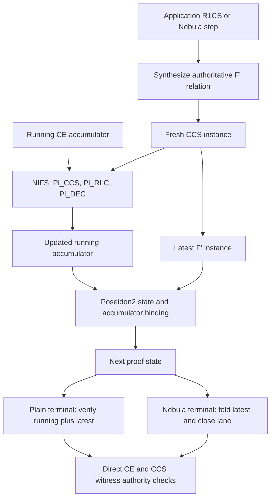

# SuperNeo, HyperNova, and Nebula Rust implementation analysis

Date: 2026-08-07

Status: Baseline audit with an implementation update. Sections marked as baseline describe the tree before the simplification.

## Contract

The requested outcome is a deep analysis of the active Rust implementation against the local SuperNeo, HyperNova, and Nebula papers and the repository `AGENTS.md` rules.

The smallest acceptance criteria are:

1. State the protocol invariants that the implementation must preserve.
2. Trace each invariant through the native prover, native verifier, recursive circuit, lifecycle, and tests.
3. Report only claims whose removal would leave correctness, soundness, protocol fidelity, or the repository rules unproved.
4. Give exact paper and code references for each accepted claim.
5. Separate implementation defects from paper security limits and unsupported features.
6. Identify code complexity that is not necessary for the active protocol, trace its callers, and state the smaller ownership model that can replace it.

### Assumptions

- The corrected Markdown copies in `docs/superneo-paper`, `docs/hypernova-paper`, and `docs/nebula-paper` are authoritative for this audit.
- The active production path is the Rust path in `neo-fold-clean` with `FoldingMode::Optimized`.
- The authoritative recursive frontends are `frontends::r1cs_f_prime::ivc` and `frontends::nebula::f_prime`.
- Generic `direct_ccs` is a lower-level frontend with a smaller soundness contract.
- This audit covers the Rust implementation. It does not audit the Lean models or prove the cryptographic assumptions.
- In the complexity review, “slop” means duplicate protocol paths, speculative backend flexibility, false public capabilities, audit-only data in runtime ownership, and wrappers that exist only to support those surfaces. Explicit circuit equations are not slop when they make the constrained relation easier to audit.

## Executive result

The main architecture is coherent and close to the three paper contracts. The authoritative R1CS and Nebula frontends compile the augmented function `F'`, include the in-circuit NIFS verifier, bind the application state, and mark preprocessing with terminal-induction authority. The compact uncompressed verifier checks the running accumulator and the latest `F'` instance. Nebula also forces the delayed memory lane to close.

One high-severity protocol mismatch remains. The production `Pi_RLC` challenge sampler does not sample the five-symbol SuperNeo challenge set exactly uniformly. Its native and circuit forms agree on the same biased mapping. The current statistical-security census does not include this distance. The circuit also uses a fixed four-digest retry window, while the native sampler retries until it succeeds.

The audit also found an evidence gap and repository-policy gaps:

| ID | Severity | Result |
|---|---|---|
| SN-1 | High | `Pi_RLC` challenge sampling is not exact uniform and its distance is absent from the security census. The circuit has a finite retry window that the native path does not have. |
| EV-1 | Medium | The complete authoritative generic R1CS terminal tests and the multi-segment authoritative Nebula test are ignored. Active component tests do not prove the same end-to-end contracts. |
| AG-1 | Medium | Several exact caps, security targets, and heuristic test gates have no stated authority or measured derivation, contrary to `AGENTS.md`. |
| AG-2 | Low | Eight Rust files exceed the approved 1,500-line ceiling. |
| DOC-1 | Low | Some soundness comments describe an old PR5 boundary, the README has two incorrect NIFS arities, and several local document links are missing. |

No tested path accepted a malformed proof. The audit did not find a mixed-hash protocol path, an omitted SuperNeo identity matrix, an unclosed accepted Nebula segment, or a compact-compression path that fails open.

The complexity review found a separate design risk. `neo-fold-clean` has three Rust representations that petition to own the augmented R1CS relation, but only one feeds the authoritative fixed-point IVC path. It also carries future backend and compact-proof interfaces that have no implementation. These are not demonstrated soundness defects. They increase audit cost and make it easier for a client or a future change to select the wrong path.

| ID | Impact | Result |
|---|---|---|
| CX-1 | High | The older R1CS F′ image compiler remains public beside the authoritative fixed-point IVC frontend. The legacy WASM entrypoint and tests still use it. |
| CX-2 | High | `FullFPrimeRelation` plus `gadget_native` form a second complete lowering model with 13,432 source lines and no runtime caller. |
| CX-3 | High | Both authoritative frontends use a fake next CCS instance, run the fold, and later replace the fake instance in proof state and audit history. |
| CX-4 | Medium | The NIFS backend interface carries deferred proof/state types, context hooks, and replay controls that no concrete backend implements. |
| CX-5 | Medium | The root API exports generic compact `compress` and `verify` functions and an opaque terminal proof type although all such verification is unsupported. |
| CX-6 | Medium | Runtime relation objects retain and re-export large audit/formal records. The R1CS IVC path also retains two copies of the selective compiler audit. |

## Simplification result

The implementation completed CX-1 through CX-5 and the necessary part of CX-6:

- The authoritative R1CS IVC and Nebula frontends are now the only runtime recursive paths.
- Recursive folding has one prepare/complete lifecycle phase. It does not create or replace a fake CCS instance.
- `ProofState` and `FoldProof` carry concrete running state and NIFS proofs. Deferred carriers, summaries, context hooks, and conversion wrappers are removed.
- The unused complete F′ relation and the obsolete R1CS/WASM image lifecycle are removed.
- The root no-op `Compressed`, `compress`, and generic `verify` API is removed. The implemented `finish_with_spartan` path remains.
- Runtime audit ownership is narrower. Formal and source-audit data that still feeds checked Lean artifacts remains.

The Rust crate changes remove 15,916 net lines, including the renamed finalization module. They do not change protocol parameters, hash families, or transcript order. SN-1, EV-1, AG-1, and AG-2 remain separate findings; they were not required to simplify the active ownership model.

## Baseline architecture and ownership

This section records the pre-change ownership that motivated the simplification. Paths that the implementation update removed no longer exist.

### Public entry points

The crate exports a small lifecycle surface at `crates/neo-fold-clean/src/lib.rs:100`:

- `prove` starts a chain.
- `extend` appends a step.
- `finish_uncompressed` produces the compact uncompressed terminal form.
- `verify_uncompressed` verifies that form.
- Audit variants keep the step history for replay and diagnostic use.
- `compress` and compressed `verify` are exported, but they return `Unsupported` because the compact backend is not complete (`crates/neo-fold-clean/src/paper/decider.rs:51`, `crates/neo-fold-clean/src/lifecycle/compress.rs:27`).

The crate documentation correctly distinguishes the authoritative compact path from the linear replay path at `crates/neo-fold-clean/src/lib.rs:35` and `crates/neo-fold-clean/src/lib.rs:52`.

### Main types

| Type | Ownership |
|---|---|
| `Preprocessing` | Verifier-owned parameters, CCS structure, Ajtai setup, verifier key, semantic-state policy, Nebula policy, and terminal-induction capability. |
| `State` | Chain counters, state digests, semantic digest, accumulator digest, public trace, active proof state, and optional Nebula lane. |
| `ProofState` | Either the exact base state or an active pair of `running` and `latest`. |
| `CcsInstance` | A fresh CCS claim and its witness. |
| `RunningInstance` | The carried batch of SuperNeo CE claims and their witnesses. |
| `Uncompressed` | Compact terminal state without the step history. |
| `UncompressedAudit` | The terminal state plus steps and public batches for linear replay. |
| `NebulaLane` | Segment counters, challenges, products, precommitted and observed lane chains, and the memory-boundary commitment. |

The verifier key binds the parameters, CCS structure, Pi_CCS header, Ajtai setup, public-input length, initial semantic state, and policy bits (`crates/neo-fold-clean/src/paper/construction2/verifier_key.rs:35`). The state validator derives base values and rejects noncanonical counters or digests (`crates/neo-fold-clean/src/paper/construction2/transition.rs:112`, `crates/neo-fold-clean/src/paper/construction2/transition.rs:149`).

### Data flow



For generic R1CS, preprocessing compiles a fixed-point relation and enables terminal induction (`crates/neo-fold-clean/src/frontends/r1cs_f_prime/ivc/chain.rs:55`, `crates/neo-fold-clean/src/frontends/r1cs_f_prime/ivc/chain.rs:77`). Each recursive step obtains the native NIFS message, synthesizes the same verifier inside `F'`, checks the exact emitted arm shape, and replaces the temporary latest instance with the actual synthesized instance (`crates/neo-fold-clean/src/frontends/r1cs_f_prime/ivc/chain.rs:138`, `crates/neo-fold-clean/src/frontends/r1cs_f_prime/ivc/chain.rs:223`, `crates/neo-fold-clean/src/frontends/r1cs_f_prime/ivc/chain.rs:344`).

The base and recursive arms both enforce the application relation. The recursive arm also enforces the complete `F'` recursive step and its semantic links (`crates/neo-fold-clean/src/frontends/r1cs_f_prime/ivc/shape.rs:336`, `crates/neo-fold-clean/src/frontends/r1cs_f_prime/ivc/shape.rs:354`).

The compact verifier first checks verifier-owned anchors and capability flags. It then selects the HyperNova terminal form or the terminal-fold form (`crates/neo-fold-clean/src/lifecycle/verify.rs:247`). The HyperNova form requires exactly one latest instance and checks its commitment, low-norm encoding, and CCS relation (`crates/neo-fold-clean/src/lifecycle/verify.rs:493`, `crates/neo-fold-clean/src/lifecycle/verify.rs:521`). The terminal-fold form reruns NIFS verification and binds its result to the recorded state (`crates/neo-fold-clean/src/lifecycle/verify.rs:592`). Both forms finish with direct authority checks on the running CE witnesses (`crates/neo-fold-clean/src/lifecycle/verify.rs:322`, `crates/neo-fold-clean/src/lifecycle/verify.rs:848`).

## Paper-to-code conformance

### SuperNeo

The corrected SuperNeo copy requires one canonical virtual identity matrix, one joint padded-row sumcheck, strict norm checks, disjoint `gamma` exponent blocks, one shared output point, uniform `Pi_RLC` challenges, and exactly `k` canonical decomposition children. The main references are `docs/superneo-paper/07-7-neo-s-folding-scheme-for-ccs.md:59`, `docs/superneo-paper/07-7-neo-s-folding-scheme-for-ccs.md:63`, `docs/superneo-paper/07-7-neo-s-folding-scheme-for-ccs.md:80`, `docs/superneo-paper/07-7-neo-s-folding-scheme-for-ccs.md:89`, `docs/superneo-paper/07-7-neo-s-folding-scheme-for-ccs.md:104`, and `docs/superneo-paper/07-7-neo-s-folding-scheme-for-ccs.md:139`.

| Contract | Rust result | Evidence |
|---|---|---|
| Canonical `M1 = [I; 0]` and one padded row cube | Conforms | `crates/neo-reductions/src/engines/pi_ccs_joint.rs:85`; `crates/neo-fold-clean/src/paper/reductions/pi_ccs.rs:199` |
| Zero-row specialization only for a clean padded relation | Conforms | `crates/neo-fold-clean/src/paper/reductions/pi_ccs.rs:416` |
| One joint `Pi_CCS` transcript with `alpha` and `gamma` over `K` | Conforms | `crates/neo-reductions/src/engines/pi_ccs_joint_protocol.rs:130` |
| Correct norm polynomial degree and joint degree | Conforms | `crates/neo-reductions/src/engines/pi_ccs_joint.rs:85` |
| Disjoint fresh, norm, and carried exponent ranges | Conforms | `crates/neo-reductions/src/engines/pi_ccs_joint_protocol.rs:130` |
| `K + k` outputs share one point `r'` | Conforms | `crates/neo-fold-clean/src/paper/reductions/pi_ccs.rs:125`; `crates/neo-fold-clean/src/paper/reductions/pi_rlc.rs:815` |
| `Pi_RLC` combines commitments, public input, evaluations, and witnesses ring-linearly | Conforms, except for challenge distribution | `crates/neo-fold-clean/src/paper/reductions/pi_rlc.rs:168`; `crates/neo-fold-clean/src/paper/reductions/pi_rlc.rs:454` |
| `Pi_DEC` emits exactly `k` canonical low-norm children and recomposes all fields | Conforms | `crates/neo-fold-clean/src/paper/reductions/pi_dec.rs:417`; `crates/neo-fold-clean/src/paper/reductions/pi_dec.rs:453` |
| NIFS verifier executes `Pi_CCS -> Pi_RLC -> Pi_DEC` | Conforms | `crates/neo-fold-clean/src/paper/nifs/verifier.rs:33` |
| Challenge vector is uniform in the strong set | Does not conform | Finding SN-1 |

The native terminal verifier also checks all five CE obligations: commitment, public projection `X`, low norm, matrix evaluations, and constant terms (`crates/neo-fold-clean/src/lifecycle/verify.rs:322`). This is the correct authority boundary for the current uncompressed proof, which carries the terminal witnesses.

### HyperNova

HyperNova Construction 2 binds the verifier key, step number, initial state, current state, running instances, and program counter in a canonical state hash. It has a true base branch, a recursive NIFS branch, and a terminal verifier that checks all running pairs and the latest pair (`docs/hypernova-paper/14_6_3_A_compiler_from_NIVC_compatible_folding_schemes_to_NIVC.md:11`, `docs/hypernova-paper/14_6_3_A_compiler_from_NIVC_compatible_folding_schemes_to_NIVC.md:27`, `docs/hypernova-paper/14_6_3_A_compiler_from_NIVC_compatible_folding_schemes_to_NIVC.md:114`).

| Contract | Rust result | Evidence |
|---|---|---|
| Canonical base state and no base NIFS call | Conforms | `crates/neo-fold-clean/src/paper/construction2/transition.rs:121`; `crates/neo-fold-clean/src/paper/f_prime/native.rs:695` |
| Recursive branch folds prior latest into running | Conforms | `crates/neo-fold-clean/src/paper/f_prime/native.rs:713`; `crates/neo-fold-clean/src/paper/f_prime/native.rs:1003` |
| State output binds verifier policy, counters, state, accumulator, and optional Nebula state | Conforms | `crates/neo-fold-clean/src/paper/construction2/transition.rs:362` |
| Recursive circuit includes the NIFS verifier and application transition | Conforms for authoritative R1CS and Nebula frontends | `crates/neo-fold-clean/src/frontends/r1cs_f_prime/ivc/shape.rs:354`; `crates/neo-fold-clean/src/frontends/nebula/f_prime/shape.rs:212` |
| Terminal verifier checks running and latest separately | Conforms for plain authoritative `F'` | `crates/neo-fold-clean/src/lifecycle/verify.rs:310`; `crates/neo-fold-clean/src/lifecycle/verify.rs:493` |
| A non-authoritative frontend cannot claim compact induction | Conforms and fails closed | `crates/neo-fold-clean/src/lifecycle/verify.rs:298`; `crates/neo-fold-clean/src/lib.rs:73` |

The implementation uses the one-program specialization `ell = 1`. The fixed program counter is valid for this specialization (`crates/neo-fold-clean/src/paper/construction2/transition.rs:112`).

### Nebula

Nebula requires commit-then-challenge ordering, exact read/write timestamp transitions, exact initial/final scan positions, four running products, a final balance equation, and continuity from one segment's final memory commitment to the next segment's initial commitment. The main references are `docs/nebula-paper/04_4-efficient-read-write-memory-in-ivc.md:19`, `docs/nebula-paper/04_4-efficient-read-write-memory-in-ivc.md:63`, `docs/nebula-paper/04_4-efficient-read-write-memory-in-ivc.md:142`, and `docs/nebula-paper/04_4-efficient-read-write-memory-in-ivc.md:159`.

| Contract | Rust result | Evidence |
|---|---|---|
| All segment lane commitments exist before `gamma` | Conforms | `crates/neo-fold-clean/src/frontends/nebula/prove.rs:113`; `crates/neo-fold-clean/src/frontends/nebula/prove.rs:184` |
| Challenge binds verifier state, plan, counters, and all precommitted lane chains | Conforms | `crates/neo-fold-clean/src/paper/construction2/nebula_lane.rs:427` |
| Read/write counts, timestamps, ROM/RAM rules, padding, and scan positions are constrained | Conforms | `crates/neo-fold-clean/src/frontends/nebula/circuit.rs:954`; `crates/neo-fold-clean/src/frontends/nebula/circuit.rs:1099` |
| Four products are threaded and the balance equation is checked | Conforms | `crates/neo-fold-clean/src/frontends/nebula/circuit.rs:1044`; `crates/neo-fold-clean/src/paper/construction2/nebula_lane.rs:547` |
| Observed commitment chains equal the precommitted chains | Conforms | `crates/neo-fold-clean/src/paper/construction2/nebula_lane.rs:519`; `crates/neo-fold-clean/src/paper/construction2/nebula_lane.rs:544` |
| Final-state commitment becomes the next initial-state commitment | Conforms | `crates/neo-fold-clean/src/paper/construction2/nebula_lane.rs:550` |
| External proof ends only at a closed segment | Conforms | `crates/neo-fold-clean/src/paper/construction2/nebula_lane.rs:563`; `crates/neo-fold-clean/src/lifecycle/verify.rs:303` |

The Rust fingerprint is a specialization, not a literal copy of the paper formula. It uses

`gamma2 - (packed(timestamp, global_index) + gamma1 * value)`

instead of

`address + gamma1 * value + gamma1^2 * timestamp - gamma2`.

The plan gives `packed` an injective range and the circuit constrains the same bit ranges (`crates/neo-fold-clean/src/frontends/nebula/fingerprint.rs:11`, `crates/neo-fold-clean/src/frontends/nebula/layout.rs:136`). Sign reversal does not change multiset equality. Unique factorization of the resulting linear factors preserves the fingerprint argument. This difference is therefore an admissible specialization, not a defect.

## Baseline complexity and simplification review

This section records the accepted complexity claims before implementation.

### Measured shape

`crates/neo-fold-clean/src` contains 92,692 Rust lines in 234 files. The `frontends` tree owns 51,906 lines. Its two largest subtrees are `frontends/r1cs_f_prime` with 25,569 lines and `frontends/f_prime` with 19,099 lines. These values are evidence about concentration. They are not new size gates.

The root says that its lifecycle surface should stay small, but it also makes `engine`, `frontends`, `lifecycle`, and `paper` public (`crates/neo-fold-clean/src/lib.rs:93`). A text census finds 146 `#[doc(hidden)]` escape hatches in 40 source files. Of these, 101 are in `engine`, `frontends/r1cs_f_prime`, and `frontends/f_prime`. The pattern shows that integration tests and artifact generators have shaped the production visibility boundary.

The main ownership conflict is:

| Path | Main entry | Lowering | Workspace use |
|---|---|---|---|
| Older image compiler | `R1csFPrimePreprocessing` + `R1csChainBuilder` | Encoded F′ image and shell structure | Legacy WASM preprocessing and tests |
| Complete model | `FullFPrimeRelation` | `gadget_native` | Tests and Lean artifact generators only |
| Authoritative IVC | `R1csIvcPreprocessing` + `R1csIvc` | Fixed-point selective lowering | Intended generic R1CS production path |

The first two paths contain useful equations and tests. Their equations do not need to remain public production alternatives to preserve that evidence.

### CX-1: remove the older R1CS F′ lifecycle after the WASM test migration

The R1CS frontend root presents the older image compiler as the frontend (`crates/neo-fold-clean/src/frontends/r1cs_f_prime/mod.rs:1`). It exports `compile_step`, `compile_chunk`, `R1csFPrimePreprocessing`, and `R1csChainBuilder` (`crates/neo-fold-clean/src/frontends/r1cs_f_prime/mod.rs:36`, `crates/neo-fold-clean/src/frontends/r1cs_f_prime/mod.rs:48`). The same module also contains three preprocessing artifact types and twelve public construction functions (`crates/neo-fold-clean/src/frontends/r1cs_f_prime/mod.rs:169`, `crates/neo-fold-clean/src/frontends/r1cs_f_prime/mod.rs:221`, `crates/neo-fold-clean/src/frontends/r1cs_f_prime/mod.rs:252`, `crates/neo-fold-clean/src/frontends/r1cs_f_prime/mod.rs:388`).

The nested `ivc` module separately states that it is the authoritative recursive path (`crates/neo-fold-clean/src/frontends/r1cs_f_prime/ivc/mod.rs:1`). Its client surface is smaller: construct `R1csIvcPreprocessing`, create `R1csIvc`, call `extend`, and call `finish` (`crates/neo-fold-clean/src/frontends/r1cs_f_prime/ivc/chain.rs:34`, `crates/neo-fold-clean/src/frontends/r1cs_f_prime/ivc/chain.rs:103`). It compiles the app and in-circuit NIFS verifier into one fixed relation.

The old builder is not an equivalent implementation of that contract. Its own documentation says that a multi-chunk result needs the audit-replay path until the compressed decider proves induction (`crates/neo-fold-clean/src/frontends/r1cs_f_prime/lifecycle.rs:456`). It also has sixteen public operations for assignment, step, chunk, adapter, audit, and finalization variants. Its recursive flow simulates an extend with a placeholder batch and keeps a `pending_audit` for a later swap (`crates/neo-fold-clean/src/frontends/r1cs_f_prime/lifecycle.rs:91`, `crates/neo-fold-clean/src/frontends/r1cs_f_prime/lifecycle.rs:489`).

The remaining product dependency is smaller than the public surface suggests. `neo-wasm` exports both the authoritative Nebula `preprocess`/`prove`/`verify` path and the older `preprocess_seeded_batched` R1CS path (`crates/neo-wasm/src/lib.rs:58`, `crates/neo-wasm/src/lib.rs:62`). Search of the workspace finds source callers of the latter only in tests. The old preprocessing implementation imports the image shell and returns `R1csFPrimePreprocessing` (`crates/neo-wasm/src/preprocess.rs:38`, `crates/neo-wasm/src/preprocess.rs:149`).

The smaller ownership model is:

- `R1csIvcPreprocessing` owns generic R1CS fixed-point compilation.
- `R1csIvc` owns the generic R1CS lifecycle.
- `WasmNebulaPreprocessing` and `WasmProver` own the WASM product path.
- Shared `R1csShape`, recursive-plan, and semantic-state value functions remain as domain code. They must not keep the old compiler alive through compatibility wrappers.

Port tests that still prove a unique protocol invariant to the authoritative owners. Delete tests that only prove the old API mechanics. Then delete the old preprocessing overloads, encoded-step compiler, builder, placeholder-audit path, and the root `preprocess_seeded_batched` WASM export. Backward compatibility is not a contract in this repository.

Proof of the migration requires active release tests for the generic R1CS terminal path and the WASM Nebula path. It also requires a caller search with no remaining reference to `R1csFPrimePreprocessing`, `R1csChainBuilder`, or `preprocess_seeded_batched` outside deleted compatibility history.

### CX-2: keep one executable augmented-relation compiler

`FullFPrimeRelation` calls itself the authoritative complete augmented relation (`crates/neo-fold-clean/src/frontends/r1cs_f_prime/full_relation.rs:1`). It feeds the `gadget_native` lowering (`crates/neo-fold-clean/src/frontends/r1cs_f_prime/full_relation.rs:35`). However, no non-test workspace caller constructs `FullFPrimeRelation`, `FullFPrimeShape`, or a gadget-native encoding. The active fixed-point compiler instead calls the selective lowering (`crates/neo-fold-clean/src/frontends/r1cs_f_prime/ivc/relation.rs:1`, `crates/neo-fold-clean/src/frontends/r1cs_f_prime/ivc/relation.rs:208`).

The unused alternative is large. `full_relation.rs` has 1,101 lines. `gadget_native.rs` and its child modules have 12,331 lines. The combined 13,432 lines implement a second relation construction, assignment materializer, trace replacement plan, cost model, and audit surface. Its only callers are tests and Lean artifact generators.

This code has audit value, especially where it generates independent refinement artifacts. The necessary part is the audit model, not a second public production compiler. The simpler ownership model is:

- The selective fixed-point compiler is the only executable compiler in the runtime frontend.
- `FullFPrimeRelation` and tests that only restate the abandoned path are removed.
- Gadget-native code that a named Lean artifact still needs moves under an explicit audit/tooling owner and is not re-exported as a normal frontend.
- An audit equation that is already checked against the active selective relation stays. A cost profile, estimator, or second materializer with no unique acceptance claim is removed.

This change must preserve the checked Lean artifacts and the active selective compiler tests. It does not need to preserve the old Rust call sites.

### CX-3: make fold preparation a real lifecycle phase

The authoritative R1CS and Nebula frontends both use the same indirect sequence:

1. Remove the current audit from the builder.
2. Copy the previous latest claim into a fake `CcsInstance` with an empty witness and a zero-size matrix.
3. Call `lifecycle::extend` with that fake instance to obtain the NIFS proof and post-fold state.
4. Synthesize the real next F′ instance from that proof.
5. Replace the fake `latest` instance and replace the last `public_batches` entry with the real claim.

The R1CS code is at `crates/neo-fold-clean/src/frontends/r1cs_f_prime/ivc/chain.rs:138` and `crates/neo-fold-clean/src/frontends/r1cs_f_prime/ivc/chain.rs:344`. The Nebula copy is at `crates/neo-fold-clean/src/frontends/nebula/f_prime/chain.rs:620` and `crates/neo-fold-clean/src/frontends/nebula/f_prime/chain.rs:1037`. Both files also define nearly identical private `PreparedStep` and `StateCoordinates` types (`crates/neo-fold-clean/src/frontends/r1cs_f_prime/ivc/chain.rs:377`, `crates/neo-fold-clean/src/frontends/nebula/f_prime/chain.rs:1082`).

The fake instance is safe under the current digest contract because the F′ chunk digest binds only the next batch count and verifier-owned claim shape, not the claim contents (`crates/neo-fold-clean/src/paper/digest.rs:456`). The design is still too indirect. `lifecycle::extend` accepts and records a complete authoritative instance when this phase needs only its shape. The frontend then mutates two records that are expected to agree.

The smaller design is one private lifecycle phase that prepares the recursive fold from verifier-owned preprocessing, the current state, semantic-state advance, and the next batch shape. It returns one owned prepared value with the NIFS message and post-fold state. A completion method consumes the prepared value and the real synthesized instance, and installs `latest` and the public audit claim once. The base branch remains direct because it has no prior fold.

This is a necessary abstraction because R1CS and Nebula already repeat the same phase. It removes a fake witness, two direct proof-state mutations, take-and-restore error paths, and the duplicate state-coordinate implementation. It also makes an incomplete prepared step hard to publish.

Proof requires byte-identical transcript messages and final public coordinates for the same inputs. Tests must also show that the installed latest claim and the last public audit claim are the real instance, and that R1CS and Nebula terminal verification still reject a changed claim, witness, NIFS proof, or semantic output.

### CX-4: reduce the NIFS backend interface to implemented capabilities

The `NifsProverAdapter` boundary itself is necessary. CPU, Metal, and CUDA types implement it, and Metal implements the fresh-instance builders (`crates/neo-fold-clean/src/paper/nifs/backend.rs:488`, `crates/neo-prover-metal/src/adapter.rs:365`). The backend choice in `neo-wasm` is also real (`crates/neo-wasm/src/prover.rs:45`).

The speculative parts are not necessary:

- `DeferredNifsProofMaterializer`, `DeferredNifsRunningMaterializer`, and the two `Deferred` carrier variants have no implementation in the workspace (`crates/neo-fold-clean/src/paper/nifs/backend.rs:51`).
- Every concrete backend returns a materialized output. Metal returns the canonical materialized output after its joint oracle, and CUDA currently delegates `prove` to CPU (`crates/neo-prover-metal/src/adapter.rs:365`, `crates/neo-prover-cuda/src/adapter.rs:46`).
- `begin_f_prime_step` and `requires_recursive_compile_reverify` have no concrete backend override. Only the crosscheck wrapper forwards them (`crates/neo-fold-clean/src/paper/nifs/backend.rs:488`, `crates/neo-fold-clean/src/paper/nifs/backend.rs:519`).
- `NifsPostFoldSummary` and its many `into_*_with_summary` forms support the old image compiler and the crosscheck wrapper. They do not carry verifier authority (`crates/neo-fold-clean/src/paper/nifs/backend.rs:196`).

After CX-1, `prove` can return the ordinary running instance and NIFS proof. Keep the adapter trait, the Metal fresh-instance hooks, and the actual joint-oracle boundary. Delete the deferred carriers, future context hook, replay-control hook, post-fold summary, and conversion matrix. If a backend later keeps verifier-visible state on a device, its implementation and measured transfer need must exist before a deferred API returns.

The proof checks are the optimized CPU NIFS tests, Metal and CUDA crosschecks, WASM backend selection tests, and a workspace caller search that shows no carrier branch remains.

### CX-5: remove public capabilities that always return `Unsupported`

The crate root exports `Compressed`, `compress`, and a generic function named `verify` (`crates/neo-fold-clean/src/lib.rs:103`, `crates/neo-fold-clean/src/lib.rs:111`). `compress` always reaches `decider::prove`, and the decider prover and verifier are placeholders that return `Unsupported` (`crates/neo-fold-clean/src/lifecycle/compress.rs:27`, `crates/neo-fold-clean/src/paper/decider.rs:51`). Workspace source has no product caller. Tests only assert that these functions fail closed.

The code also exposes `TerminalCeProof`, an opaque byte container whose documentation says that it has no successful verifier (`crates/neo-fold-clean/src/paper/terminal_ce/proof.rs:3`). In contrast, `engine::decider` is a useful full-history audit R1CS and says explicitly that it is not a compact production decider (`crates/neo-fold-clean/src/engine/decider.rs:1`). The direct terminal CE relation is also necessary for current soundness.

The smaller and more honest boundary is:

- Keep `finish_uncompressed` and `verify_uncompressed` as the working generic lifecycle.
- Keep the narrower, implemented `finish_with_spartan` path under its frontend contract.
- Move the full-history statement builder and R1CS synthesis under an explicit audit name.
- Remove the root `Compressed`, `compress`, and generic `verify` exports, and remove the unsupported opaque terminal proof plumbing.
- Keep the direct terminal CE relation that current verification uses.

There is no compatibility requirement that justifies a public function whose only result is an error. The unsupported-path tests can be deleted. Audit relation and terminal authority tests must stay.

### CX-6: separate runtime state from audit and formal tooling

`r1cs_f_prime::mod` re-exports a large set of selective row, provenance, width, and artifact types (`crates/neo-fold-clean/src/frontends/r1cs_f_prime/mod.rs:64`). The IVC module also re-exports its detailed fixed-point and PiCCS digest audits beside `R1csIvc` (`crates/neo-fold-clean/src/frontends/r1cs_f_prime/ivc/mod.rs:15`). The Lean manifest types are re-exported from the crate root even though no non-test workspace client uses them (`crates/neo-fold-clean/src/lib.rs:116`).

The active relation also retains audit data twice. `MultiBranchLowNormR1cs` stores an optional full `SelectiveCompilerAudit` (`crates/neo-fold-clean/src/frontends/r1cs_f_prime/lowering.rs:142`). The R1CS fixed-point compiler borrows and clones that record into `R1csIvcCompilationAudit`, while the relation keeps the original (`crates/neo-fold-clean/src/frontends/r1cs_f_prime/ivc/relation.rs:208`, `crates/neo-fold-clean/src/frontends/r1cs_f_prime/ivc/relation.rs:236`). The record contains nested vectors of row runs, rewrites, openings, stage ranges, and polynomials (`crates/neo-fold-clean/src/frontends/r1cs_f_prime/selective_audit.rs:617`).

The simpler ownership model has three explicit surfaces:

- The runtime surface owns lifecycle types and the authoritative R1CS and Nebula entrypoints.
- The backend surface owns only the implemented NIFS and witness-opening contracts needed by Metal, CUDA, and WASM.
- The audit surface owns formal manifests, row projections, cost records, full-history synthesis, and test mutations.

The selective compiler should return the relation and its audit as separate owned outputs. The runtime relation keeps matrices and encoding maps. The frontend moves the audit into its audit result once; it does not keep an `Option` and a clone. Nebula can retain only the width record that its public audit method returns.

This does not require hiding equations or removing formal evidence. It changes who owns them. The workspace build, downstream Metal/CUDA/WASM builds, artifact equality tests, and authoritative terminal tests prove the change.

### Complexity claims rejected by the MSW rule

- **Delete `NifsProverAdapter` because traits are abstract.** Rejected. Three concrete backends use the boundary, and Metal implements backend-specific work.
- **Delete PaperExact from the repository.** Rejected. The independent PaperExact engine in `neo-reductions` and the NIFS crosscheck are valid audit oracles. They must stay outside ordinary tests unless the user approves their use, as `AGENTS.md` requires.
- **Merge native and circuit implementations.** Rejected. The verifier circuit and the native prover must be distinct implementations whose transcript and outputs are crosschecked. Sharing authority-producing code would weaken the check.
- **Replace every long argument list with a configuration object.** Rejected. Explicit protocol data flow is often safer than a broad bag of options. A parameter object is admissible only when it represents one real domain value.
- **Consolidate all 132 explicit Cargo test targets.** Rejected. No measured build or maintenance failure proves that target count is the cause. Separate binaries can also control link memory and failure isolation.
- **Shorten explicit constraint code only because it is verbose.** Rejected. Row emission is necessary when each equation has a clear owner. Remove duplicate relation owners and diagnostic ceremony before compressing arithmetic.
- **Split every large file into arbitrary pieces.** Rejected. `AGENTS.md` requires files above 1,500 lines to be split, but the split must follow ownership. File count alone does not make the design simpler.

### Simplification order

The smallest dependency order is:

1. Port unique legacy R1CS and WASM tests to the authoritative R1CS IVC or WASM Nebula owners, then delete the old image lifecycle and public compatibility entrypoints.
2. Add the private prepare/complete lifecycle phase and use it from both authoritative frontends. Delete their placeholder and duplicated state code.
3. Remove `FullFPrimeRelation` as a production alternative. Keep only named gadget-native artifact work under audit ownership.
4. Delete the now-unused deferred NIFS carriers, post-fold summary, and unused adapter hooks. Keep the implemented backend seam.
5. Remove the unsupported generic compression API and future opaque proof plumbing. Keep the active direct terminal checks and full-history audit relation.
6. Narrow the public runtime/backend/audit surfaces and move the selective compiler audit into one owner.

Each step has its own caller and test proof. None requires a compatibility layer.

## Accepted findings

### SN-1: `Pi_RLC` does not sample the strong set exactly uniformly

Severity: High.

#### Contract

SuperNeo requires every public verifier message to be sampled uniformly from its declared finite challenge set. A bit-string implementation must be exact or account for its statistical distance (`docs/superneo-paper/04-4-preliminaries.md:119`). The `Pi_RLC` proof uses uniform `rho_i` values from `C` (`docs/superneo-paper/13-d-deferred-theorems-and-proofs.md:359`). The Goldilocks profile uses 54 coefficients from the five-symbol alphabet `[-2, -1, 0, 1, 2]` (`docs/superneo-paper/11-b-concrete-parameters.md:37`, `crates/neo-params/src/lib.rs:88`).

#### Implementation

The native sampler calls `digest32`, splits its canonical field encodings into 16-bit chunks, rejects only `65535`, and maps each accepted chunk modulo 5 (`crates/neo-reductions/src/common.rs:634`, `crates/neo-reductions/src/common.rs:826`). `digest32` serializes four canonical Goldilocks elements (`crates/neo-transcript/src/poseidon2.rs:282`).

Canonical field elements are uniform in `[0, q)`, not in `[0, 2^64)`. Let

```text
B = 2^16
q = 2^64 - 2^32 + 1 = B^4 - B^2 + 1
N = (B - 1) / 5 = 13,107
```

The first accepted 16-bit digit always exists in the first canonical field limb. Across all `q` field values, the counts for the first output symbol are:

```text
symbol 0: N(B^3 + B^2) + 1 = 3,689,348,813,882,916,865
symbols 1..4: N(B^3 + B^2) = 3,689,348,813,882,916,864 each
```

Thus the first-symbol statistical distance from uniform is exactly

```text
4 / (5q) = 4.3368086909517596e-20, approximately 2^-64.321928
```

A nonuniform marginal proves that the full 54-symbol vector is not uniform in `C`.

The current security census counts the joint field term and the coordinate-fork term, and uses `5^54` as the challenge-set cardinality (`crates/neo-params/src/lib.rs:472`). It does not include a sampler-distance term. Therefore, the existing 96-bit or 100-bit statistical floor is not proved for the implemented sampler. This result does not prove a forgery. It proves that the paper theorem's sampling premise is false and that the current transfer from the ideal protocol omits a term whose distance is at least about `2^-64.32`.

#### Circuit completeness mismatch

The recursive circuit implements the same chunk mapping, but it fixes four digest calls and 64 chunks for 54 outputs (`crates/neo-fold-clean/src/engine/r1cs_circuit/alphabet_sampling/mod.rs:46`). It rejects when fewer than 54 chunks are accepted (`crates/neo-fold-clean/src/engine/r1cs_circuit/alphabet_sampling/acceptance.rs:28`). The native sampler continues until it has 54 outputs.

There are valid canonical field outputs with more than ten rejected 16-bit chunks across the four digests. For those transcript states, the native sampler continues and the circuit relation is unsatisfiable. In the ideal uniform-field-output model, this event has positive probability. The code documentation only claims parity conditional on enough accepts (`crates/neo-fold-clean/src/engine/r1cs_circuit/alphabet_sampling/mod.rs:52`). Thus, unconditional perfect completeness is not proved. The tests copy the native algorithm and prove parity for selected traces, but they do not prove exact distribution or unconditional completeness (`crates/neo-fold-clean/tests/gadgets/alphabet_sampling.rs:27`).

#### Required closure

The native sampler, circuit sampler, and security census need one authoritative distribution contract. The selected implementation must either sample the five-symbol set exactly or include a proved statistical-distance and finite-window failure term. Native and circuit behavior must be identical for every transcript state.

### EV-1: active tests do not close the authoritative end-to-end proof gap

Severity: Medium.

Both end-to-end tests for the authoritative generic R1CS terminal path are ignored because fixed-point preprocessing exceeds the five-minute cap (`crates/neo-fold-clean/tests/system/r1cs_ivc_terminal.rs:22`, `crates/neo-fold-clean/tests/system/r1cs_ivc_terminal.rs:78`). These tests are the ones that exercise a real multi-step compiled `F'`, compact running-plus-latest verification, state threading, and terminal tamper rejection.

The authoritative multi-segment Nebula chain test is also ignored because of its memory cost (`crates/neo-fold-clean/tests/nebula/f_prime.rs:430`). Active Nebula tests prove lane equations, red-team checks, and one-step or component behavior. They do not prove the same multi-segment fixed-point lifecycle.

The active `per_step_ccs_structure_must_encode_f_prime` test uses a 50,000-column size floor (`crates/neo-fold-clean/tests/system/ivc_invariants.rs:50`). Size is not semantic proof that the relation contains the correct NIFS verifier and state links.

No code failure was observed. The finding is an acceptance-evidence gap: the most important authoritative paths have no active release test that completes under the repository cap.

### AG-1: exact limits do not identify their authority or derivation

Severity: Medium.

`AGENTS.md:141` permits an exact limit only when the requester, a technical contract, authoritative project policy, or measured evidence supplies its value. The source must state that authority or derivation.

The following limits do not do so:

- `MAX_ROUNDS = 8` for generic R1CS fixed-point compilation (`crates/neo-fold-clean/src/frontends/r1cs_f_prime/ivc/relation.rs:107`).
- `MAX_ROUNDS = 8` for Nebula fixed-point compilation (`crates/neo-fold-clean/src/frontends/nebula/f_prime.rs:203`).
- The default 16,000,000 committed-coordinate budget (`crates/neo-fold-clean/src/frontends/r1cs_f_prime/ivc/relation.rs:31`).
- The 100-bit minimum, two-bit margin, 64-bit Nebula target, and 16-bit Fiat-Shamir query cap (`crates/neo-fold-clean/src/config.rs:40`). The security-parameter note still asks whether the 100-bit floor is acceptable (`crates/neo-fold-clean/open-questions/security-parameters.md:228`).
- The 50,000-column and 50,000-witness-cell test floors, and the 10 percent growth gate (`crates/neo-fold-clean/tests/system/ivc_invariants.rs:61`, `crates/neo-fold-clean/tests/system/ivc_invariants.rs:155`, `crates/neo-fold-clean/tests/system/ivc_invariants.rs:216`). Their comments call them generous values, not derived bounds.

Some other exact bounds are valid. For example, Nebula derives counter and packing limits from the public wire widths and the injective field packing (`crates/neo-fold-clean/src/frontends/nebula/layout.rs:136`). The problem is not the existence of a number. The problem is the absence of an authority or derivation for the listed values.

### AG-2: eight Rust files exceed 1,500 lines

Severity: Low.

`AGENTS.md:9` sets a 1,500-line ceiling unless the user gives explicit approval. These Rust files exceed it:

| Lines | File |
|---:|---|
| 1,939 | `crates/neo-reductions/src/superneo_eval.rs` |
| 1,851 | `crates/neo-ajtai/src/commit.rs` |
| 1,744 | `crates/neo-fold-clean/tests/system/sha256_bellpepper_batching.rs` |
| 1,736 | `crates/neo-fold-clean/src/frontends/r1cs_f_prime/selective_projected_rows.rs` |
| 1,685 | `crates/neo-fold-clean/tests/f_prime/r1cs.rs` |
| 1,530 | `crates/neo-fold-clean/src/frontends/r1cs_f_prime/structure.rs` |
| 1,504 | `crates/neo-fold-clean/src/frontends/f_prime/image.rs` |
| 1,502 | `crates/neo-wasm/src/layout.rs` |

`crates/neo-fold-clean/src/lifecycle/verify.rs` is exactly 1,500 lines and does not violate the ceiling.

This is an auditability and maintenance finding. It is not evidence of a protocol error.

### DOC-1: protocol documentation does not match the active implementation

Severity: Low.

- The parent frontend documentation says no frontend proves the `F'` relation until a future PR5 (`crates/neo-fold-clean/src/frontends/mod.rs:17`). This remains true for generic `direct_ccs`, but it is false for the authoritative R1CS and Nebula fixed-point frontends.
- The native `F'` module says the in-circuit gadget is future work (`crates/neo-fold-clean/src/paper/f_prime/native.rs:1126`), although the authoritative recursive circuit exists.
- The README says `Pi_CCS` emits `k` fresh claims and `Pi_DEC` emits `k-1` children (`README.md:99`, `README.md:107`). The corrected SuperNeo protocol emits `K + k` claims from `Pi_CCS` and exactly `k` children from `Pi_DEC`.
- The README links `docs/architecture`, `docs/audits`, and `docs/plans`, but these paths are absent (`README.md:144`).
- The Nebula visual guide calls a missing file normative: `specs/nebula-superneo-implementation.md` (`docs/nebula-integration/README.md:4`).

These statements can direct a reviewer to the wrong soundness boundary. The active code is more complete than some comments state, while the missing links remove the intended design evidence.

## Security boundaries that are not implementation defects

### Fiat-Shamir and hash assumptions

HyperNova states that a generic public-coin protocol does not by itself prove Fiat-Shamir knowledge soundness. For a concrete hash, the required properties are plain-model assumptions (`docs/hypernova-paper/26_B_Achieving_non_interactivity_for_multi_folding_schemes.md:63`). SuperNeo also says that its Rust transcript and Fiat-Shamir conformance are separate obligations (`docs/superneo-paper/09-supplementary-material.md:23`).

The Rust implementation uses Poseidon2 for the inspected protocol transcript and public digest paths (`crates/neo-transcript/src/poseidon2.rs:8`, `crates/neo-fold-clean/src/paper/digest.rs:1`). This satisfies the repository hash-family policy. It does not create a new theorem for the concrete Poseidon2 instantiation.

### Constant-step scope

The corrected HyperNova theorem proves knowledge soundness only for each fixed constant iteration count. It does not give one uniform extractor for a polynomially growing count (`docs/hypernova-paper/10_5_Non_uniform_incrementally_verifiable_computation.md:28`, `docs/hypernova-paper/14_6_3_A_compiler_from_NIVC_compatible_folding_schemes_to_NIVC.md:139`). The Rust counters can represent long chains, but the paper result does not justify a stronger uniform knowledge-soundness claim.

### Classical extraction

The SuperNeo copy uses classical rewinding and excludes quantum-prover extraction and quantum-random-oracle Fiat-Shamir security (`docs/superneo-paper/00-front-matter.md:14`). The Rust implementation does not change this scope.

### Zero knowledge

The uncompressed proof contains terminal witnesses and the verifier checks them directly. HyperNova states that its current randomization layer is not proved zero-knowledge or knowledge-sound (`docs/hypernova-paper/15_7_HyperNovas_zero_knowledge_and_succinctness_layer.md:1`). The current Rust proof must not be described as zero-knowledge.

### Compact compression

The false generic compression seam is removed. The crate does not expose an opaque compact proof type or a generic compression function that can only return an error. The separate `finish_with_spartan` path remains under its narrower frontend-specific contract.

## Test evidence

All commands used release mode and the required five-minute cap. No `PaperExact` mode was used.

### Simplification checks

| Check | Result |
|---|---|
| Workspace release check | Passed for `neo-fold-clean`, `neo-wasm`, Metal, and CUDA crates |
| All `neo-fold-clean` release test targets, compile only | Passed in 3m 04s |
| Direct optimized NIFS adapter crosscheck | Passed |
| Recursive and terminal lifecycle adapter test | Passed |
| Selective PiDEC source audit | 1 passed, 1 policy-ignored |
| Selective rectangular lowering | 11 passed, 1 policy-ignored |
| Nebula F′ | 3 passed, 1 resource-ignored |
| Construction-2 encoded F′ structure invariant | Passed |
| Changed WASM relation and execution targets | 57 passed |

The full `neo-wasm --no-run` command reached the required five-minute cap without a compiler error and is a failed aggregate check by repository policy. Each changed WASM target then compiled and passed under its own capped command.

### Baseline audit checks

| Test target | Passed | Ignored | Result used for |
|---|---:|---:|---|
| `rot_rho_tests` | 8 | 0 | Strong-set matrix form and rotation checks |
| `padded_row_identity_strictness` | 7 | 0 | Virtual identity and clean padding |
| `gadgets_alphabet_sampling` | 6 | 0 | Native/circuit trace parity and rejection tamper checks |
| `reductions_nifs_v` | 49 | 0 | `Pi_CCS`, `Pi_RLC`, `Pi_DEC`, and NIFS verifier behavior |
| `system_r1cs_ivc_terminal` | 0 | 2 | Complete authoritative generic R1CS path; both tests are ignored |
| `nebula_redteam` | 3 | 4 | Nebula tamper checks available under the active profile |
| `f_prime_nebula_lane_circuit` | 11 | 0 | Native/circuit lane transition parity |
| `nebula_circuit` | 7 | 0 | Read/write, scan, product, and range constraints |
| `nebula_f_prime` | 3 | 1 | Fixed-point frontend components; multi-segment test is ignored |
| `nebula_lifecycle` | 5 | 0 | Segment lifecycle and close checks |
| `system_lifecycle_redteam` | 10 | 0 | Terminal state and witness tamper rejection |
| **Total** | **109** | **7** | No failures |

Focused tests prove the reduction and memory subcontracts. They do not remove EV-1 because the ignored tests exercise a different end-to-end composition.

## Rejected claims

These claims failed the MSW necessity test. Each has evidence that closes it without a change.

- **The implementation omits SuperNeo's first identity matrix.** Rejected. The joint engine injects and validates the virtual identity geometry, and the paper layer checks identity-first outputs.
- **The different Nebula fingerprint formula is unsound only because it is different.** Rejected. The packed tuple map is injective on the constrained domain, and sign reversal preserves multiset equality.
- **Three Nebula commitment lanes omit one of the four multisets.** Rejected. The ops lane contains the paired RS and WS data. The other two lanes contain IS and FS. All four products are distinct.
- **Generic direct CCS can silently claim recursive induction.** Rejected. The preprocessing capability is verifier-owned, and compact multi-chunk verification fails closed without it.
- **Removing the generic compression placeholder creates a verifier gap.** Rejected. No product caller used it, it could not produce or verify a proof, and the implemented frontend-specific Spartan path remains.
- **A mixed hash family appears in a protocol-binding path.** Rejected for the inspected Rust scope. SHA-256 references are application-circuit content; protocol transcripts and public digests use Poseidon2.
- **The Nebula switchboard circuit is mandatory for this build.** Rejected. The implementation uses the valid `ell = 1` specialization, so no universal switchboard is necessary.

## Closure order

The smallest order that closes the accepted claims is:

1. Define and implement one exact `Pi_RLC` sampler contract for native and circuit code, then add its complete statistical accounting.
2. Add a small active authoritative R1CS terminal test and a small active multi-segment Nebula test that complete within the project cap.
3. Record owner authority or measured derivation for each listed exact limit. Remove a limit if no authority exists.
4. Split the eight oversized Rust files at real ownership boundaries.
5. Correct the stale soundness comments, NIFS arities, and missing document links.

The first item is the only accepted finding that changes the paper-level protocol claim. The other items improve proof evidence, repository-policy conformance, and auditability.
