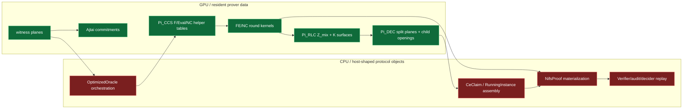
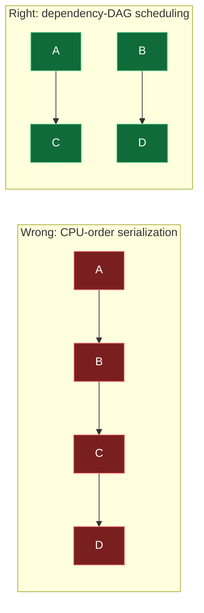
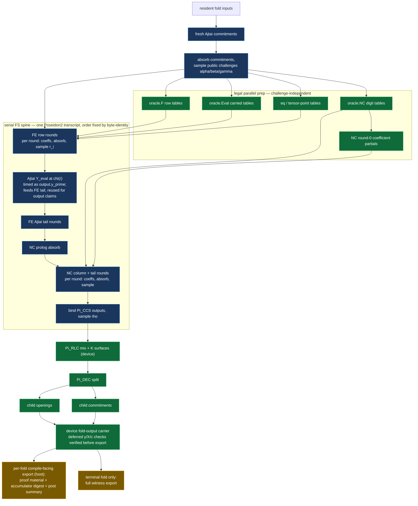
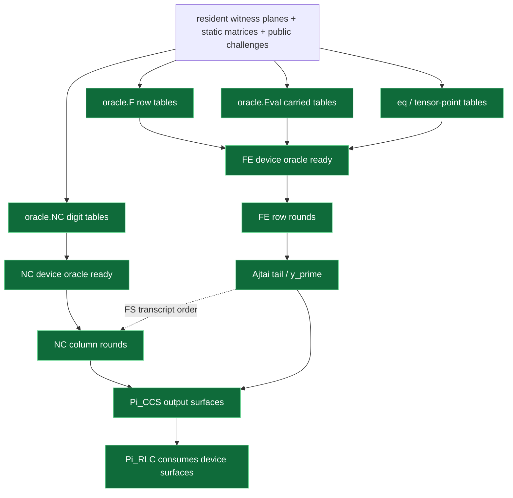

# CUDA SuperNeo Flow State

This note shows the current CUDA migration state for the SuperNeo/NIFS prover.
It is intentionally architecture-facing: the point is to see which protocol
modules are still CPU-shaped, where intermediate values leave the GPU, and how
the scheduler should look when independent work exists.

Last updated: 2026-07-06, after correcting the multichain online timer,
serializing full terminal-witness D2H exports, and clearing aggregate `8x`
for both full-audit and terminal-private 8-chain gates.

Source measurements:

- Full-audit baseline:
  `benchmark-results/gpuprof/20260706T184133Z-packed-oracle-rowtables-repeat3.json`
- Online result: CPU `2181.4ms`, CUDA `449.5ms`, `4.85x`, proof byte-identical.
- Device-backed running-carrier check:
  `benchmark-results/gpuprof/20260706T-running-carrier-final.json`
- Running-carrier result: CPU `2201.4ms`, CUDA `451.3ms`, `4.88x`, proof
  byte-identical, residency clean.
- Fast GPU-resident terminal contract gate: `e2e_gpu_fast_bench`, CPU
  `2200.9ms`, CUDA `418.2ms`, `5.26x`, claims-only audit byte-identical
  while `e2e_bench` still covers full terminal-witness parity.
- Restore check after rejecting standalone FE row proof-log deferral:
  `benchmark-results/gpuprof/20260706T-revert-standalone-fe-row-export-repeat3.json`
- Restore result: CPU `2195.5ms`, CUDA `453.6ms`, `4.84x`, proof
  byte-identical, residency clean.
- Multichain throughput probe:
  `benchmark-results/gpuprof/20260706T-multichain-shared-context.json`
- Multichain result: `2` independent chains, shared CUDA context, separate streams;
  aggregate CPU `4363.9ms`, parallel CUDA `812.4ms`, `5.37x`, `1.21x`
  overlap versus sequential CUDA, proof byte-identical.
- Production-mode 8-chain terminal-private throughput gate:
  `timeout 300s cargo +nightly-2026-04-03 oxide build --features cuda` then
  `timeout 300s ./target/release/parity e2e_multichain8_fast_bench`.
- 8-chain terminal-private result: aggregate CPU `17444.8ms`, parallel CUDA
  `1942.4ms`, `8.98x`, `1.79x` overlap versus sequential CUDA,
  terminal-claims audit byte-identical. Full terminal-witness parity remains
  covered by `e2e_bench` and the full-audit multichain gate.
- 8-chain full-audit result: aggregate CPU `17542.2ms`, parallel CUDA
  `2181.2ms`, `8.04x`, full audit and terminal witnesses byte-identical.
- Multichain online-timer contract: the parallel wall stops when each worker
  completes `append + finish`; terminal witness parity materialization,
  audit `Debug` formatting, and claims-only audit formatting run after the
  online wall is recorded. This matches the CPU aggregate, which is computed
  from `cpu.online_ms()`.
- Full-audit export scheduling: terminal private-witness D2H is serialized
  with a process-local export lock. Eight concurrent 45MB D2H copies over the
  same PCIe path were worse than ordered final exports.
- Latest profiling artifact:
  `benchmark-results/gpuprof-e2e-full-audit-after-8x/gpuprof.json`.
- Tooling source: `gpuprof`; the full-audit baseline is repeat-3 and
  residency-gated, while the multichain probe intentionally reports the
  current doubled sumcheck D2H budget violation.

Percentages below are not security claims. They are migration/ownership
estimates grounded in the current implementation and profiler evidence.
`GPU busy / wall` is measured by `gpuprof`; it may exceed `100%` when async work
is attributed to the phase that enqueued it.

## Latest State Delta

The headline state is current, but it means two different things:

```text
single-chain online prove:        449.5ms CUDA median, 4.85x vs CPU
two-chain parallel probe:         812.4ms CUDA wall, 5.37x aggregate vs CPU
eight-chain full-audit probe:    2181.2ms CUDA wall, 8.04x aggregate vs CPU
eight-chain terminal-private:    1942.4ms CUDA wall, 8.98x aggregate vs CPU
```

The shared-context probes confirm that independent chains can overlap on one
GPU, and that separate CUDA contexts were not the main issue. The current
saturation point is still around eight chains: `9`/`10` chains previously added
contention faster than useful work and `12` chains exceeded device memory
during NC. Full-audit now clears `8x` only after the online timer excludes
post-prove parity formatting and final witness D2H is ordered; terminal-private
remains faster because a downstream GPU consumer can keep those planes on
device.

Current top-level read:

| Question | Current answer |
|---|---|
| Earliest SuperNeo module that is not fully GPU-owned | `fold.superneo.pi_ccs.oracle` |
| Biggest repeated boundary in the single-chain fast path | `Pi_CCS sumcheck.fe.row_download` and host proof-log ownership |
| Biggest aggregate boundary in the multichain probe | `Pi_DEC emit/download`, now ordered at terminal export; remaining pressure is row-download and host claim assembly |
| Best use of multichain right now | Proven aggregate throughput lever for independent chains; not a substitute for removing single-chain host joins |
| Next structural target | Device-backed fold-output/proof carrier that can consume Pi_CCS proof logs and Pi_DEC child surfaces without re-exporting them per fold |

Important negative result: moving the FE row proof-log export from
`Pi_CCS sumcheck.fe.row_download` to `fold.egress.export` is not progress by
itself. The 2026-07-06 retry removed the row-download leaf but raised the
online CUDA median to about `465ms`, because the same proof material still had
to leave the device later. The restored path is back in the `450ms` band. Do
not retry FE row proof-log deferral as a standalone slice; it needs a
downstream device-backed proof/fold-output consumer.

Current positive slice: the recursive F' state now carries the CUDA-produced
running accumulator through `NifsRunningCarrier` instead of forcing a full
host-owned `RunningInstance` as the repeated-loop authority. The CUDA adapter
returns a deferred running carrier for cached next-step output, while still
materializing the NIFS proof at egress. This is intentional: deferring the
proof without a device proof consumer was measured slower because it broke
workspace reuse and only relocated the D2H boundary.

Do not read the multichain stage rows as one fold's cost: that artifact profiles
the whole gate, including CPU reference, sequential CUDA, and parallel CUDA
passes. It is useful for boundary pressure and overlap, while the full-audit
repeat-3 artifact remains the main single-chain baseline.

## SuperNeo Flow

```mermaid
flowchart TD
    Ingest["fold.ingest<br/>mixed, ~60% GPU-owned"]
    Commit["fold.commit.fresh<br/>mostly GPU, ~80%"]
    Bind["Pi_CCS bind + public challenges<br/>mixed, ~55%"]
    Oracle["Pi_CCS oracle<br/>mixed, ~45%<br/>F tables packed on GPU"]
    FE["Pi_CCS sumcheck.fe<br/>mixed, ~55%"]
    NC["Pi_CCS sumcheck.nc<br/>mostly GPU, ~80%"]
    CcsOut["Pi_CCS output<br/>mixed, ~70%"]
    Rhos["Pi_RLC rho sampling<br/>mixed, ~70%"]
    RlcClaims["Pi_RLC combine_claims<br/>mostly CPU, ~25%"]
    RlcMix["Pi_RLC mix_witness<br/>GPU, ~95%"]
    RlcOut["Pi_RLC output surfaces<br/>mostly GPU, ~90%"]
    DecSplit["Pi_DEC split<br/>mixed, ~65%"]
    DecOpen["Pi_DEC open/commit children<br/>mostly GPU, ~85%"]
    DecEmit["Pi_DEC emit child claims/proof<br/>mixed/CPU boundary, ~35%"]
    Accumulate["fold.accumulate<br/>host RunningInstance boundary, ~20%"]
    Egress["fold.egress/finalize<br/>CPU proof boundary, ~25%"]

    Ingest --> Commit --> Bind --> Oracle --> FE --> NC --> CcsOut
    CcsOut --> Rhos --> RlcClaims --> RlcMix --> RlcOut
    RlcOut --> DecSplit --> DecOpen --> DecEmit --> Accumulate --> Egress

    classDef gpu fill:#0f6b3a,stroke:#68d391,color:#ffffff;
    classDef mixed fill:#7a5a00,stroke:#f6c453,color:#ffffff;
    classDef cpu fill:#7a1f1f,stroke:#fc8181,color:#ffffff;

    class RlcMix,RlcOut gpu;
    class Ingest,Commit,Bind,Oracle,FE,NC,CcsOut,Rhos,DecSplit,DecOpen mixed;
    class RlcClaims,DecEmit,Accumulate,Egress cpu;
```



## Current State By Execution Order

| Order | SuperNeo stage | Current state | GPU-owned % | Measured GPU busy / wall | Evidence / blocker |
|---:|---|---|---:|---:|---|
| 1 | `fold.ingest` | Mixed. Fresh input enters device; running planes can be resident. | 60% | 8% | Expected H2D for new input, but repeated running data should stay device-resident. |
| 2 | `fold.commit.fresh` | Mostly GPU. Ajtai commit kernels run on device. | 80% | 60% | Still has fresh input H2D and 20 joins. |
| 3 | `Pi_CCS bind + challenge_alpha_gamma` | Mixed. Whole-phase modes can device-sample, default row path is still CPU-shaped. | 55% | small | Not the top cost, but still not fully device-owned in the hot path. |
| 4 | `Pi_CCS oracle` | Mixed. Device-owned plan exists; host oracle construction still owns the phase boundary. | 45% | 17% single-chain | Single-chain: `38.3ms` wall, `6.7ms` busy, `80` launches. Multichain aggregate: `208.7ms` wall, `30.0ms` busy, `319` launches, showing the same boundary scales poorly. |
| 5 | `Pi_CCS oracle.F` | Packed GPU row-table path. | 70% | async | `f_var` row tables now build as one `(table,row)` kernel family: `32 -> 4` launches for SHA, no repeated host table materialization. |
| 6 | `Pi_CCS oracle.Eval` | Partly GPU. Carried eval tables have device kernels. | 55% | 46% | Still has host orchestration, H2D, joins, and scratch churn. |
| 7 | `Pi_CCS oracle.NC` | Mostly GPU for resident digit data. | 75% | async | Small current cost, but ownership remains split by CPU oracle flow. |
| 8 | `Pi_CCS sumcheck.fe` | Device kernels exist, but the row-trace/proof-log boundary is still host-shaped. | 55% | 22% single-chain | Single-chain: `115.7ms` wall, `25.9ms` busy, `384` launches, including `25.4ms` row-download. Multichain aggregate: `552.3ms` wall, `124.1ms` busy, `1559` launches; `row_download` alone is `130.6ms` wall. |
| 9 | `Pi_CCS sumcheck.nc` | Mostly GPU-owned. | 80% | 97% | High busy ratio; still many launches/joins, but not the first module to attack. |
| 10 | `Pi_CCS output.y_prime / claims` | GPU computes surfaces; host proof objects remain. | 70% | 99% for `y_prime` | `y_prime` is good GPU work; claims/proof materialization still crosses to host. |
| 11 | `Pi_RLC challenge_rhos` | Device rho sampling after host digest bind. | 70% | async | Naive device Pi_CCS digest bind was rejected: it added underfilled Poseidon hash kernels and regressed badly. |
| 12 | `Pi_RLC combine_claims` | Mostly host shell. | 25% | 0% | About `9.9ms` host algebra/shell. |
| 13 | `Pi_RLC mix_witness` | GPU-owned. | 95% | async | Resident witness mix runs on device. |
| 14 | `Pi_RLC output.k_surfaces` | Mostly GPU-owned. | 90% | async | Resident Pi_CCS surfaces feed RLC device combine. |
| 15 | `Pi_DEC split` | GPU split kernel, but host boundary remains. | 65% | 1% | Apparent `~29ms` lever; prior split-only attempts moved the join elsewhere. |
| 16 | `Pi_DEC commit/open_children` | Mostly GPU-owned. | 85% | async / high | Child y-ring/y-zcol/commit kernels run on device. |
| 17 | `Pi_DEC emit` | Major CPU/proof boundary. | 35% | 0-6% | Single-chain: `53.4ms` wall, `50.2MB` D2H. Multichain aggregate: `231.9ms` wall, `148.8MB` D2H; this is the largest proof-output boundary after Pi_CCS. |
| 18 | `fold.accumulate` | Mixed. Running state can be carried as a deferred CUDA-backed carrier; proof/audit shells still materialize host objects. | 45% | n/a | The repeated loop no longer requires a full host running witness, but the compile/audit boundary still needs a host shell and accumulator authority. |
| 19 | `fold.egress / finalize` | CPU proof boundary. | 25% | n/a | Final proof/audit/decider materialization lives here. |

## First Module To Attack

The first module in execution order that is not fully GPU-owned is still:

```text
fold.superneo.pi_ccs.oracle
```

This is the earliest architectural leak. The biggest repeated symptom it feeds
is the downstream `Pi_CCS sumcheck.fe.row_download` / proof-log boundary, where
device round data is still made into host protocol objects before the next
device-owned stages can proceed.

The exact current shape is:

```text
resident witness planes
  -> DevicePiCcsOraclePlan for resident F/Eval/NC inputs
  -> packed GPU row-table kernel for oracle.F
  -> host-owned oracle/control objects
  -> FE consumes the result through a CPU-shaped engine seam
```

The desired shape is:

```text
resident witness planes
  -> DevicePiCcsOraclePlan
  -> device-resident F/Eval/NC/Q tables
  -> FE consumes device oracle buffers directly
  -> host sees only final proof/public material or parity-only replay
```

## Current CPU/GPU Boundary Map



The bad pattern is not just transfer cost. It is that CPU objects still act as
intermediate protocol modules between GPU stages.

## How It Should Run

CUDA-friendly scheduling must follow the dependency graph, not the old CPU call
order.

Bad CPU-shaped schedule:

```text
A -> B -> C -> D
```

Correct schedule when the real dependency graph is:

```text
A -> C
B -> D
A and B independent
```



For SuperNeo there is one more edge type the module view hides: **transcript
edges are dependency edges.** Pi_CCS runs one sequential Poseidon2 transcript
(FE row rounds -> FE Ajtai tail -> NC prolog -> NC column/tail rounds;
`optimized_engine/phase_trace.rs`, `prove.rs`). Every round absorbs
coefficients and samples a challenge, so every NC challenge transitively
depends on the full FE chain, and every chi(r)-based evaluation depends on the
FE row challenges. Work may run in parallel only if it does not consume a
challenge the spine has not sampled yet — otherwise proof bytes change and
parity fails.

The dependency-correct target schedule:



The spine's per-round kernels are small by protocol construction (single-block
transcript/round kernels; `fe_round_partials` runs 1 block on a 128-SM GPU).
A single fold therefore cannot fill the GPU during the row/column ladder no
matter how it is scheduled — core principle 2 is a chain-level question:


Within one chain this pipeline is irreducibly serial: `compile_chunk k+1`
consumes fold k's proof/accumulator authority (audited 2026-07-05/06), so the
GPU idles during compile and the CPU idles during folds. The structural fixes
are a compiler split (new architecture, audited as not free) or scheduling an
independent chain/proof into the idle windows — multi-chain throughput fills
the spine's underfilled rounds without touching proof bytes.

The current shared-context multichain gate proves that this direction is real
but not sufficient by itself:

```text
one chain full-audit CUDA:        ~450ms online
two chains sequential CUDA:       ~987ms online wall
two chains parallel CUDA streams: ~812ms online wall
overlap:                         ~1.21x
aggregate speedup vs CPU:        ~5.37x
```

Interpretation: separate chains do overlap, but they still contend on the same
chatty protocol boundaries (`Pi_CCS` row proof-log export, `Pi_DEC` emit,
`Pi_RLC` host shell) and on many underfilled one-block kernels. To reach a
large aggregate speedup, multichain scheduling must be paired with a more
device-owned fold-output/proof boundary, not just more host threads.

Rules for this target shape:

1. Transcript edges are dependency edges. The FS spine is serial and its order
   is fixed by byte-identity; never schedule a kernel that consumes a
   challenge the spine has not sampled yet.
2. Intermediate module outputs stay in device buffers; host protocol objects
   are not reconstructed between GPU stages.
3. Legal parallelism is: prep lanes (tables), DEC child fan-out, and
   cross-fold/cross-chain work — not FE-vs-NC round concurrency. The one
   candidate "already-sampled" evaluation, Ajtai Y_eval at chi(r), turned
   out to sit ON the spine: the FE tail consumes it (`fe.rs`
   `enqueue_full_fe_phase_body`), and output claims reuse the same buffer
   (`output.rs`), so there is no independent y_prime to overlap with NC.
4. The per-fold compile-facing export (proof material + accumulator digest +
   post summary) is part of the repeated loop's contract: the recursive F'
   compiler consumes it every fold. Budget it; do not design it away.
5. Underfilled spine rounds are protocol-structural. Recover cores with
   coarser scheduling (multi-fold/multi-chain), not by parallelizing the
   spine.
6. CPU parity replay stays outside the timed fast path, and the
   verifier/decider still recomputes proof challenges from proof material;
   device challenge values are never verifier authority.

## Immediate Architecture To-Do

1. Widen the fold-output/proof carrier so a CUDA fold can carry resident
   `Pi_CCS` proof logs, `Pi_CCS` output surfaces, and `Pi_DEC` child surfaces
   as one device-backed result.
2. Remove `Pi_CCS sumcheck.fe.row_download` only when the retained proof log
   is consumed by that device-backed carrier. Relocating the same D2H to
   egress is a rejected standalone pattern.
3. Keep `Pi_CCS output` surfaces as device intermediates through RLC.
4. Extend the new deferred running carrier into a broader fold-output carrier
   through DEC emit/accumulate, so `CeClaim`, `RunningInstance`, and
   `NifsProof` are host shells only at parity/audit/final boundaries.
5. Use shared-context, separate-stream scheduling for independent chains only
   after the fold-output boundary is device-owned enough that concurrency does
   not just amplify host joins.
6. Materialize `CeClaim`, `RunningInstance`, and `NifsProof` only at parity,
   audit, verifier, decider, or final proof boundaries.

## Next Code Slice: Device-Backed Fold Output

The previous Pi_CCS-local attempt proved the wrong shape: deferring FE row
proof-log export without changing the proof consumer only moves D2H from
`Pi_CCS` to egress. The next implementation should widen the repeated fold
output instead of adding another local copy/stream tweak.

Current shape:

```text
Pi_CCS device row logs + output surfaces
Pi_RLC device K surfaces
Pi_DEC device child surfaces
  -> host CeClaim / RunningInstance / NifsProof materialization
  -> StepProof / audit / next F' compile
```

Target shape:

```text
DeviceFoldOutput
  owns resident Pi_CCS logs and output surfaces
  owns resident Pi_DEC child surfaces and accumulator summary
  exposes the minimal F' post-fold summary needed by the next compile step
  materializes CeClaim / RunningInstance / NifsProof only for parity, audit,
  verifier, decider, or final proof export
```

The Pi_CCS part of that carrier should still expose its internal task graph
instead of inheriting the old CPU call order:



This is the dependency rule for the code:

```text
Do not serialize oracle.F -> oracle.Eval -> oracle.NC -> FE
when the real dependencies are:

oracle.F + oracle.Eval + eq tables  -> FE rounds          (data)
oracle.NC tables                    -> NC rounds          (data)
FE rounds + tail --FS transcript--> NC rounds             (order)
FE row challenges r                 -> Y_eval / y_prime   (data)
FE + NC + tail                      -> Pi_CCS output      (data)
Pi_CCS output                       -> Pi_RLC

The table builds are the parallel part. The rounds themselves stay on the
FS spine: NC rounds follow FE rounds in the transcript, so only NC table
prep and NC round-0 partials may overlap FE.
```

Implementation constraints:

- Start from `fold.superneo.pi_ccs.oracle`, not from later RLC/DEC cleanup.
- Use CUDA streams or graph capture only where the dependency graph says work
  is independent.
- Keep all intermediate oracle tables and output surfaces device-resident.
- Do not introduce a second protocol owner in `neo-prover-cuda`; `neo-reductions`
  still defines the protocol, while CUDA owns execution scheduling and buffers.
- The CPU fallback/parity path may replay or materialize host objects, but the
  timed fast path must not require host oracle objects between GPU stages.

Acceptance criteria:

1. `gpuprof` / `gpuscope` shows fewer host joins or lower host-owned time in
   `fold.superneo.pi_ccs.oracle`.
2. FE starts from device-owned oracle buffers, not host-rebuilt row snapshots.
3. NC digit/table prep is not forced to wait behind unrelated FE table work.
4. Pi_CCS output surfaces remain device-owned through Pi_RLC.
5. CPU-vs-CUDA final proof bytes remain identical.
