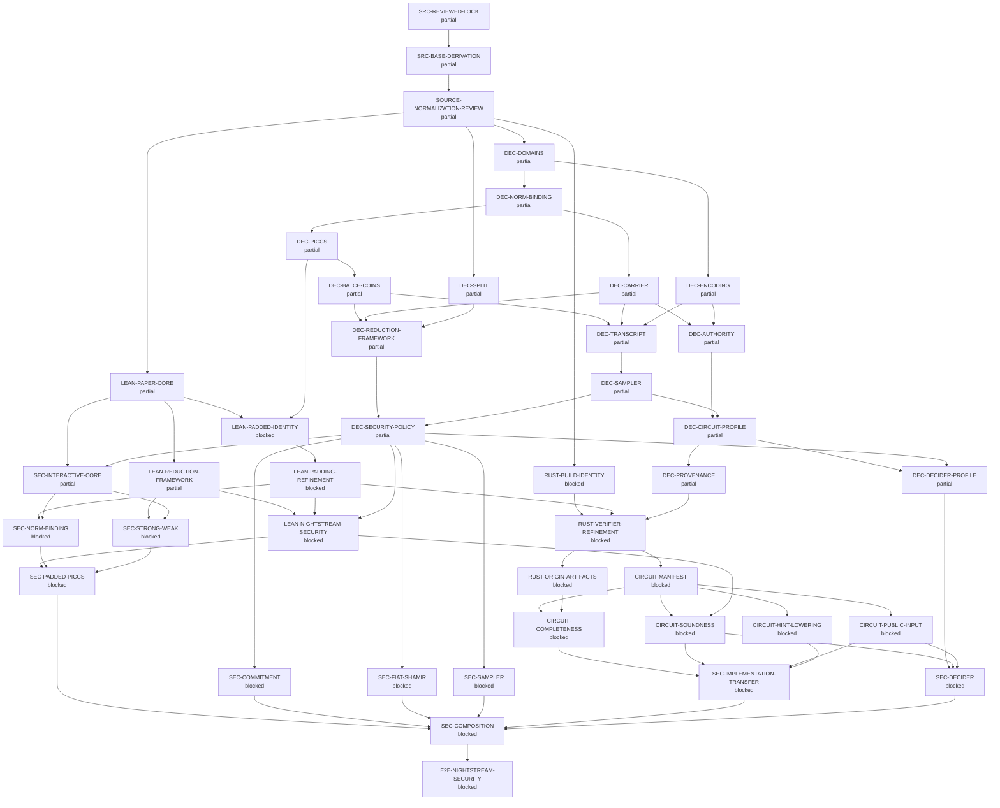

# Nightstream assurance claim graph

This file is generated from `src/assurance/graph.json` and the leaf claim files.
It does not own claim state.

## Release gates

| Gate | Derived state | Required claims |
|---|---|---|
| `G0-MECHANICAL-SOURCE` | blocked | `SRC-REVIEWED-LOCK`, `SRC-BASE-DERIVATION` |
| `G0B-SEMANTIC-SOURCE` | blocked | `SOURCE-NORMALIZATION-REVIEW` |
| `G1-DECISIONS` | blocked | `DEC-DOMAINS`, `DEC-NORM-BINDING`, `DEC-PICCS`, `DEC-BATCH-COINS`, `DEC-CARRIER`, `DEC-SPLIT`, `DEC-ENCODING`, `DEC-TRANSCRIPT`, `DEC-SAMPLER`, `DEC-AUTHORITY`, `DEC-REDUCTION-FRAMEWORK`, `DEC-SECURITY-POLICY`, `DEC-CIRCUIT-PROFILE`, `DEC-DECIDER-PROFILE`, `DEC-PROVENANCE` |
| `G2-LEAN` | blocked | `LEAN-PAPER-CORE`, `LEAN-REDUCTION-FRAMEWORK`, `LEAN-PADDED-IDENTITY`, `LEAN-PADDING-REFINEMENT`, `LEAN-NIGHTSTREAM-SECURITY` |
| `G3-RUST` | blocked | `RUST-BUILD-IDENTITY`, `RUST-VERIFIER-REFINEMENT`, `RUST-ORIGIN-ARTIFACTS` |
| `G4-CIRCUIT` | blocked | `CIRCUIT-MANIFEST`, `CIRCUIT-COMPLETENESS`, `CIRCUIT-SOUNDNESS`, `CIRCUIT-PUBLIC-INPUT`, `CIRCUIT-HINT-LOWERING` |
| `G5-SECURITY` | blocked | `SEC-INTERACTIVE-CORE`, `SEC-NORM-BINDING`, `SEC-STRONG-WEAK`, `SEC-PADDED-PICCS`, `SEC-COMMITMENT`, `SEC-FIAT-SHAMIR`, `SEC-SAMPLER`, `SEC-IMPLEMENTATION-TRANSFER`, `SEC-DECIDER`, `SEC-COMPOSITION`, `E2E-NIGHTSTREAM-SECURITY` |
