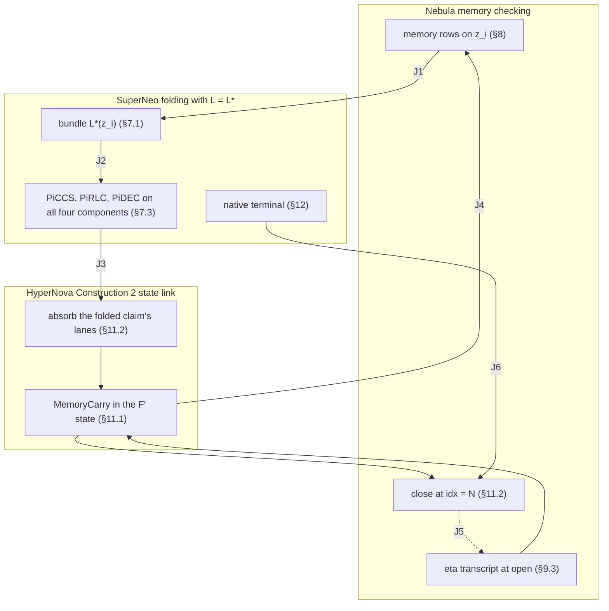

# Nebula memory phase on SuperNeo F′ — protocol specification

Status: **Proposed.** This document is not approved for implementation. The
trunk decisions authorize Stage 1 only. A Stage 2 memory relation needs an
explicit owner decision.

Base revision: `nico/f-prime-constraints-cuda-formal` at `42df46bef`.

Security companion: [`nebula-superneo-security.md`](./nebula-superneo-security.md).
It holds the security goal, the assumptions, the lemmas, and the error bound.
This file holds the protocol only.

On acceptance, this pair replaces the August V2 draft set
(`docs/Nebula-on-Superneo/`) and the historical `specs/` files on
`nico/nebula-m0-frontend`.

The key words **MUST**, **MUST NOT**, and **MAY** state requirements.

## 1. Scope

This specification adds one Nebula memory phase to the Stage 1 F′ system, as
`FPRIME_LEAN_ARCHITECTURE_SPEC.md` §6 requires. The phase supplies:

- public ROM and RAM in one flat address space;
- fixed application memory ports;
- segmented offline memory checking with public-coin fingerprints;
- a memory carry in the F′ state;
- terminal memory acceptance and a final memory root.

An accepting proof attests one execution of the verifier-selected application
relation. The execution starts from the statement's initial application state
and the plan's initial memory. It ends in the statement's final application
state. Every memory access goes through a port and is sequentially consistent.

Out of scope: application semantics (for example WASM), stacks, private
initial memory, zero knowledge, more than one checked step per fresh claim, and
more than one fresh claim per fold.

### 1.1 Overview (informative)

This subsection explains how the phase joins the Stage 1 stack. The rules are
in §6–§13.

Three layers keep their own protocols:

- **SuperNeo** folds claims with the linear map `L*` (§7.1). It treats the
  four-component bundle as one commitment, so PiCCS, PiRLC, and PiDEC do not
  change.
- **HyperNova Construction 2** links each invocation to the next through the
  hash of the F′ state. The memory carry (§11) is a new block of that state.
- **Nebula** checks memory with fingerprints of four multisets (§8). Each
  segment closes with the checks of Nebula's `F_final` (§11.2).

The layers meet at six joints:

| Joint | Mechanism | Spec |
|---|---|---|
| J1 | The lanes stay in the step assignment `z`. `L*` also commits each lane in its own component. | §6.3, §7.1 |
| J2 | PiCCS absorbs the fresh bundle. The prior-state digest holds the 16 running bundles. PiRLC and PiDEC act on all four components. | §7.3, §7.4 |
| J3 | `absorb` adds the lane components of the claim that NIFS just verified to the chains `D_seen`. | §11.2 |
| J4 | The memory rows read `η`, `h`, `ts`, and `idx` from the authenticated carry and write the new values back. | §8, §11.1 |
| J5 | The proposed roots and `D_mem` enter the `η` transcript. The close checks that the absorbed chains equal them. | §9.3, §11.2 |
| J6 | The verifier opens the last claim, then runs `absorb` and `close` natively. | §12, §13 |

One segment runs in five stages:

1. **Open.** The prover proposes the ops root and the FS root. The relation
   derives `η` from them, `D_mem`, `ts`, and `plan_digest`. To compute the
   roots, the prover must first run the whole segment natively.
2. **Step.** Each invocation runs the memory rows on its own assignment. The
   rows update the four products. The lanes of the step go into the bundle of
   the fresh claim that the invocation produces.
3. **Fold and absorb.** The next invocation folds that claim with SuperNeo.
   Then `absorb` adds the three lane commitments of the claim to `D_seen`.
4. **Close**, when `idx = N`. The chains must equal the roots that entered
   `η`, and the product equation must hold. Then `D_mem` takes the FS root.
5. **Terminal.** The verifier runs `absorb` and `close` on the last claim,
   outside the circuit.



Security note §4 gives the argument for each joint and its status.

## 2. Sources and authority

The published papers are the source of truth:

- Nebula: §3 (Constructions 1 and 2), §4.2, §4.3, Appendix A, in the
  published text pinned in `docs/nebula-paper-original.zip`. The corrected
  working copy in `docs/nebula-paper/` is not the authors' text and is not
  authority here.
- SuperNeo v1.2 (`docs/superneo-paper-v1_2/`): §5–§8 and Appendix B.
- HyperNova: Construction 2 (§6.3) and Lemma 4.
- Coral: reference material only. This specification requires no Coral
  construction.

`FPRIME_LEAN_ARCHITECTURE_SPEC.md` §2 lists the corrected copies
`docs/nebula-paper/` and `docs/hypernova-paper/`. This specification follows
the owner rule that the published text is the source of truth. It uses a
corrected copy only where that copy adds a premise: the HyperNova Lemma 4
premises (security note A4). It does not use the corrected `F_scan` timestamp
range checks, because security note Lemma 6 shows that they are not needed.
At the base revision, only `docs/superneo-paper-v1_2/` is in git. The other
paper paths are local working-tree copies.

This specification depends on these trunk documents and does not restate
them:

| Trunk document | What this specification uses |
|---|---|
| `FPRIME_LEAN_ARCHITECTURE_SPEC.md` §3, §4, §5, §6 | Stage 1 profile, authority model, lifecycle, Stage 2 phase rule |
| `decisions/padded-row-identity-piccs.md` | One-joint PiCCS; no column challenge, `s_col`, or `y_zcol` |
| `decisions/piccs-prior-state-digest.md` | PiCCS absorbs the prior-state digest, then the fresh statement |
| `decisions/fprime-stage1-main-ajtai-setup.md` | `κ = 22`, main seed, wide reduction |
| `decisions/fprime-ajtai-shake128-setup.md` | SHAKE128 key expander |
| `decisions/fprime-stage1-domain-2p28.md` | `2^28` joint row and carrier domain |
| `decisions/fprime-stage1-per-application-packages.md` | Verifier-owned application package |

If this specification and a trunk decision disagree, the trunk decision is
authority until this specification is amended.

Lean is the authority for logical builders, physical layout, and transcript
framing, as `FPRIME_LEAN_ARCHITECTURE_SPEC.md` §4 states. This specification
fixes the logical content and order. It does not fix column numbers.

## 3. Inherited base profile

| Symbol | Value | Source |
|---|---|---|
| `q` | `2^64 − 2^32 + 1` | Stage 1 profile |
| `F` | `GF(q)` | Stage 1 profile |
| `𝕂` | `F[U]/(U² − 7)`, `|𝕂| = q²` | `neo_math::K`; field facts in the security note A5 |
| `R_F` | `F[X]/(X^54 + X^27 + 1)`, `d = 54` | Stage 1 profile |
| `b`, `k_ρ`, `B` | `2`, `16`, `2^16` | `CLAUDE.md` policy; architecture spec §3 |
| fold arity | 1 fresh + 16 running = 17 PiRLC inputs | architecture spec §3 |
| PiDEC children | 16 | architecture spec §3 |
| CCS matrices | 7 | architecture spec §3 |
| `κ` | 22; one main commitment is `κ·d = 1,188` field words | main Ajtai setup decision |
| key expander | SHAKE128, `nightstream-ajtai-shake128-wide256-v1` | SHAKE128 decision |
| row domain | `2^28` | domain decision |
| `H` | Poseidon2, width 16, rate 12, capacity 4, digest 4 | `neo-params::poseidon2_goldilocks` |

A digest is four canonical field elements. Every digest and challenge in this
document uses `H` through the trunk v1.1 transcript primitives (`reset_v1_1`,
`absorb_block_v1_1`, `squeeze_digest_v1_1`, `squeeze_extension_v1_1`).

`α` and `γ` always mean the PiCCS challenges, and `ρ` always means the PiRLC
challenges. The memory challenges are `η`.

## 4. Verifier-owned memory plan

### 4.1 Plan fields

The verifier key binds one `NebulaPlan`:

| Field | Meaning |
|---|---|
| `r`, `μ` | ROM has `R = 2^r` cells; RAM has `M = 2^μ` cells |
| `W_ts` | timestamp width in bits |
| `B_ops` | operation slots per step |
| `B_scan` | scan slots per step |
| `N` | steps per segment |
| `S_max` | maximum segments per proof |
| `rom_image` | `R` words of 32 bits |
| `ram_image` | `M` words of 32 bits |

A cell value is one 32-bit word. A proof has at most `S_max · N` steps. This
is the fixed iteration bound of HyperNova Lemma 4 for this verifier key.

### 4.2 Validity rules

Setup MUST reject a plan that breaks any of these rules:

1. **Exact cover:** `N · B_scan = R + M`.
2. **Timestamp range:** `S_max · N · B_ops < 2^W_ts`.
3. **Field encoding:** `W_ts ≤ 62`. Then every timestamp, global index, and
   value is an integer below `q`, its field encoding is injective, and row O4
   (§8.1) cannot wrap modulo `q`.
4. **Address width:** `r ≤ μ`. The address field has `μ` bits. Only ROM
   addresses need a range gate (§8.1, O6).
5. **Positive sizes:** `B_ops, B_scan, N, S_max ≥ 1`.
6. **Security:** the plan passes the setup check in the security note §5.

The counter widths follow from the plan:

```text
W_step = ⌈log2(N + 1)⌉        holds idx in [0, N]
W_seg  = ⌈log2(S_max + 1)⌉    holds seg_idx in [0, S_max]
W_cnt  = ⌈log2(B_ops + 1)⌉    holds cnt in [0, B_ops]
```

An implementation MUST derive these widths. It MUST NOT use fixed widths.

### 4.3 Plan digest

```text
plan_digest = Digest("Nightstream/Nebula/v3/plan",
                     [r, μ, W_ts, B_ops, B_scan, N, S_max],
                     rom_image, ram_image)
```

Each integer and each image word enters as one canonical field element. The
verifier computes `plan_digest`. A prover-supplied value is invalid.

The verifier-context description of `decisions/piccs-prior-state-digest.md`
MUST include `plan_digest`, `D_init` (§9.2), and the two lane-map setup IDs
(§7.2).

## 5. Memory model

The global index of a cell is:

```text
g(ROM, a) = a,        0 ≤ a < R
g(RAM, a) = R + a,    0 ≤ a < M
```

Each cell has a state `(v, t)`: a value and the timestamp of its last access.
At chain start, ROM cells hold `rom_image`, RAM cells hold `ram_image`, and
every timestamp is zero.

`ts` is the global timestamp: the number of active operations so far. It never
resets. Each active operation on a cell with old state `(v, rt)` does this:

```text
read(space, a):          RS ← (rt, g, v)      WS ← (ts+1, g, v)      cell ← (v, ts+1)
write(RAM, a, v_new):    RS ← (rt, g, v)      WS ← (ts+1, g, v_new)  cell ← (v_new, ts+1)
```

A write to ROM is invalid. At segment open, `IS` holds one tuple `(t, g, v)`
for every cell. At segment close, `FS` holds one tuple for every cell. For an
honest segment, `IS ∪ WS = RS ∪ FS` holds as multisets.

## 6. Records and lanes

### 6.1 Operation slot

An operation slot has these fields, in this order:

| Field | Bits | Meaning |
|---|---|---|
| `pad` | 1 | `1` = inactive slot |
| `is_write` | 1 | `0` = read, `1` = write |
| `is_ram` | 1 | `0` = ROM, `1` = RAM |
| `addr` | `μ` | address inside the namespace |
| `v_r` | 32 | value read (for a write: the old value) |
| `v_w` | 32 | value written back (for a read: equal to `v_r`) |
| `rt` | `W_ts` | timestamp of the previous access to the cell |

An inactive slot has every other field equal to zero. Inactive slots MAY
appear at any position, because application ports have fixed positions (§10).
Active slots keep their physical position.

For slot `j` of a step with incoming timestamp `ts`:

```text
cnt_j = Σ_{i ≤ j} (1 − pad_i)                (active count in slot order)
wt_j  = ts + cnt_j                           (write timestamp)
g_j   = addr_j + is_ram_j · R
RS_j  = (rt_j, g_j, v_r_j)                   for an active slot
WS_j  = (wt_j, g_j, v_w_j)                   for an active slot
```

### 6.2 Scan slot

A scan slot has `(v: 32 bits, t: W_ts bits)`. Each step has an initial-snapshot
(IS) chunk and a final-snapshot (FS) chunk of `B_scan` slots each. Slot `j` of
step `idx` describes the cell `g = idx · B_scan + j`. This index is structural.
The relation computes it from `idx` and the slot constant. Exact cover gives
one IS tuple and one FS tuple for every cell in every segment. There are no
scan pads.

### 6.3 Lanes

Three fixed column ranges of the step assignment `z` hold the records:

```text
P_ops(z): the B_ops operation slots
P_is(z):  the B_scan IS slots
P_fs(z):  the B_scan FS slots
```

Encoding: slot-major, then field order, then little-endian bits. One
coordinate holds one bit. Every lane coordinate is in `{0, 1}`.

**L-ALIGN.** Each range MUST start and end on a ring-column boundary (a
multiple of 54 coordinates). The relation MUST constrain alignment
coordinates to zero. A range that cuts a ring element does not commute with
the ring scalars of PiRLC (security note Lemma 1).

The IS and FS ranges MUST have the same width and the same encoding. Segment
continuity (§9.2) depends on this.

### 6.4 Lane residency

A fingerprint factor (§8.2) has tuple content `(t, g, v)` and, for an operation
slot, a pad gate. The relation MUST derive the tuple content and the gate only
from:

1. lane coordinates of the same step;
2. the carry fields `ts` and `idx` that the step reads (§8), and structural
   constants;
3. the counter values `cnt_j`, which the counter rows (O2) fix as functions of
   lane coordinates.

The challenges `η` and the product values MUST appear only as fingerprint
coefficients and accumulators. The relation compiler MUST check this column
dependency statically and MUST reject a relation that breaks it. A tuple input
that depends on `η` lets a prover choose memory content after the challenge.

## 7. Commitment bundle

### 7.1 Product map

The step commitment is the linear map

```text
L*(z) = ( L_full(z),  L_ops(P_ops(z)),  L_mem(P_is(z)),  L_mem(P_fs(z)) ).
```

`L_full` is the Stage 1 main commitment. `L_ops` and `L_mem` are the §7.2
lane maps. The IS and FS components MUST use the same map `L_mem`. The
four-component value is the commitment coordinate of the SuperNeo CCS and CE
claims:

```text
CommitmentBundle { full: κ ring elements, ops, is, fs: κ_lane ring elements each }
```

All four components are mandatory and use this order. A claim with a missing,
extra, or wrong-size component is invalid.

The lane coordinates stay inside `z`. So `L_full` binds the whole assignment,
and each lane component binds its lane a second time. This keeps the Stage 1
opening unchanged (security note Lemma 1). The lane components are necessary
because `z` holds the challenges `η`, so `L_full(z)` cannot enter the
challenge transcript. The lane components do not depend on `η` (§6.4).

### 7.2 Lane-map setup

`L_ops` and `L_mem` use the SHAKE128 expander of
`decisions/fprime-ajtai-shake128-setup.md` with the main seed and their own
setup IDs:

| Map | Setup ID | Columns |
|---|---|---|
| `L_ops` | `nightstream-nebula-ops-shake128-wide256-v1` | width of `P_ops` / 54 |
| `L_mem` | `nightstream-nebula-mem-shake128-wide256-v1` | width of `P_is` / 54 |

Both maps have rank `κ_lane`. A lane holds bits, so the lane maps need only
binding for bit vectors (security note A2). A new decision record MUST fix
`κ_lane`, the expander input layout for the two setup IDs, and a Module-SIS
estimate at infinity norm 1 for the widest lane. After its own multi-target
allowance, that estimate MUST be at least the main-key level of 110.685 bits.
`κ_lane` sets the bundle size, so it sets most of the Stage 2 hashing cost.

### 7.3 Folding behavior

SuperNeo runs unchanged with `L = L*`:

- PiCCS MUST copy each input bundle to its output claim. The native verifier
  and the recursive circuit MUST enforce this equality.
- PiRLC MUST combine all four components with the same `ρ` values and the same
  source order.
- PiDEC MUST reconstruct all four parent components from the same 16 children
  and radix powers.

### 7.4 Transcript binding

These rules extend `decisions/piccs-prior-state-digest.md`:

1. PiCCS MUST absorb the complete fresh bundle (all four components) before it
   derives `α` and `γ`.
2. The prior-state digest preimage MUST contain, for each of the 16 running
   claims, the complete bundle, the public input, and every `Eval_K` and
   `Eval_A` value. The trunk preimage has this form for the single commitment
   (`crates/nightstream/src/lifecycle/inputs.rs`). Stage 2 replaces that
   commitment block with the bundle. A digest whose preimage omits any part of
   any running claim is invalid. Security note Lemma 2 gives the forgery.
3. PiCCS MUST absorb its complete output before PiRLC samples `ρ`.

### 7.5 Terminal openings

The terminal check MUST open the 16 final PiDEC children and the trailing
fresh claim `u_{T−1}` (§12). For each of these 17 claims, one bounded witness
MUST:

1. open all four bundle components;
2. satisfy the claim's relation: CE with every matrix evaluation for a child,
   CCS for the fresh claim, and the public projection in both cases;
3. meet the norm bound that the Stage 1 terminal applies to that claim.

Separate witnesses for the opening and the relation check are invalid.

## 8. Per-step memory relation

Each invocation runs one step (§12). The step evaluates these rows on the
invocation's own assignment `z`. The rows read the carry fields `η`, `h`,
`ts`, and `idx` after the invocation's `absorb`, `close`, and `open` actions
(§11.2). The rows write the new `h`, `ts`, and `idx` into the output carry.

### 8.1 Operation rows

For each operation slot `j`:

| # | Constraint |
|---|---|
| O1 | every lane coordinate and auxiliary bit is in `{0, 1}` |
| O2 | `cnt_j = cnt_{j−1} + (1 − pad_j)`, with `cnt_{−1} = 0`, as a `W_cnt`-bit word |
| O3 | `(1 − is_write_j) · (v_w_j − v_r_j) = 0` |
| O4 | `(1 − pad_j) · (wt_j − rt_j − 1 − diff_j) = 0`, where `diff_j` is a `W_ts`-bit auxiliary word |
| O5 | `is_write_j · (1 − is_ram_j) = 0` |
| O6 | `(1 − is_ram_j) · addr_bit_{j,k} = 0` for each `k ∈ [r, μ)` |
| O7 | `pad_j · w = 0` for each word `w ∈ {is_write, is_ram, addr, v_r, v_w, rt}` |
| O8 | `h_rs_j = h_rs_{j−1} · (pad_j + (1 − pad_j) · f_η(RS_j))` |
| O9 | `h_ws_j = h_ws_{j−1} · (pad_j + (1 − pad_j) · f_η(WS_j))` |

O4 is an integer relation because `diff_j` is range-checked and §4.2 rule 3
keeps every term below `2^62`. It gives `rt_j < wt_j`. Each chain `h_*_{−1}` starts from the carry value `h`.

### 8.2 Fingerprint

```text
f_η(t, g, v) = g + η1 · v + η1² · t − η2      in 𝕂
```

This is the `Hash` function of Nebula §4.3, with the address `a` replaced by
the global index `g`. The challenges are in `𝕂`, not in `F` (§15).

### 8.3 Scan rows

For each scan slot `j` with `g_p = idx · B_scan + j`:

| # | Constraint |
|---|---|
| S1 | every IS and FS coordinate and auxiliary bit is in `{0, 1}` |
| S2 | `h_is_j = h_is_{j−1} · f_η(t^IS_j, g_p, v^IS_j)` |
| S3 | `h_fs_j = h_fs_{j−1} · f_η(t^FS_j, g_p, v^FS_j)` |

### 8.4 Boundary rows

```text
out.ts  = ts + cnt_{B_ops−1},     out.ts < 2^W_ts
out.h   = the last value of each product chain
out.idx = idx + 1
```

## 9. Commitment chains and memory challenges

### 9.1 Digest primitive

```text
Digest(tag, block_1, …, block_n):
  tr ← reset_v1_1()
  absorb_block_v1_1(tr, tag as field words, one per ASCII byte)
  for each block: absorb_block_v1_1(tr, block)
  return squeeze_digest_v1_1(tr)
```

`encode(C)` is the `κ_lane · 54` canonical coefficients of a lane commitment,
ring element first, then degree `0..53`.

### 9.2 Chains

```text
chain_ops(j, D, C) = Digest("Nightstream/Nebula/v3/chain-ops", [j, D], encode(C))
chain_mem(j, D, C) = Digest("Nightstream/Nebula/v3/chain-mem", [j, D], encode(C))
header_ops         = Digest("Nightstream/Nebula/v3/header-ops", [plan_digest])
header_mem         = Digest("Nightstream/Nebula/v3/header-mem", [plan_digest])
```

A lane chain over the commitments `C[0..N)` of one segment is

```text
D[0] = header_l,   D[j+1] = chain_l(j, D[j], C[j]),   root = D[N]
```

with `l = ops` for the ops lane and `l = mem` for both the IS and the FS lane.
This is the chain `C_i = hash(C_{i−1}, C_ω)` of Nebula Construction 2, with a
domain tag, the step index, and a header added. The IS and FS chains MUST use
the same formulas. Then the FS root of segment `k` equals the IS root of
segment `k + 1` when the snapshots are equal.

`D_init` is the IS root over the `N` initial-snapshot commitments that the plan
images define. The verifier computes `D_init` at setup. It is part of the
verifier context (§4.3).

### 9.3 Challenge transcript

At segment open, the prover proposes the ops root `D_pre.ops` and the FS root
`D_pre.fs` of the segment. The IS root of the segment MUST be `D_mem`: the FS
root of the previous segment, or `D_init`. The relation derives the
challenges:

```text
tr ← reset_v1_1()
absorb_block_v1_1(tr, "Nightstream/Nebula/v3/eta" as field words)
absorb_block_v1_1(tr, [plan_digest])
absorb_block_v1_1(tr, [ts])
absorb_block_v1_1(tr, [D_pre.ops, D_mem, D_pre.fs])
η1 ← squeeze_extension_v1_1(tr)
η2 ← squeeze_extension_v1_1(tr)
```

These inputs fix every tuple of the segment's four multisets. The three roots
fix the lane commitments (security note Lemma 3). `ts` fixes the write
timestamps. `plan_digest` fixes the tuple layout. `D_mem` MUST be absorbed:
without it, a prover could learn `η` first and then choose the previous
segment's final snapshot. The proposals get authority only from the close
check (§11.2).

## 10. Application memory ports

The application relation and the operation lane share fixed physical port
positions. For each port, the application relation MUST constrain the active
flag, the read or write mode, the namespace, the address, the value returned to
the application, and the value that a write requests. The operation slot at
the same position MUST equal those values.

Every semantic memory access of the application MUST use one port. No other
memory path is allowed. An inactive port maps to a canonical pad slot. The
verifier key binds the port table.

**Idle step.** A segment has exactly `N` steps, because exact cover needs all
of them. The application relation MUST accept an idle step: every port is
inactive and the application state does not change. An idle step MAY occur at
any step. The prover uses idle steps to fill the last segment. The iteration
count `T` includes them.

## 11. Memory carry

### 11.1 MemoryCarry

The F′ state holds one memory carry:

```text
MemoryCarry {
  seg_idx:  W_seg bits       // segments closed so far
  idx:      W_step bits      // steps run in the open segment
  ts:       W_ts bits        // global timestamp; never resets
  η1, η2:   𝕂                // challenges of the open segment
  h[4]:     𝕂                // running products (rs, ws, is, fs)
  D_pre:    2 digests        // proposed ops and FS roots of the open segment
  D_seen:   3 digests        // chains over the absorbed claims (ops, is, fs)
  D_mem:    digest           // FS root of the last closed segment, or D_init
}
```

Between invocations, one segment is always open and `1 ≤ idx ≤ N`. The claim
of the latest step is not absorbed yet, so `D_seen` covers `idx − 1` claims.

The carry is a new component of the F′ state. Its encoding is one block of the
state preimage: the fields in the order above, each integer as one field
element, each `𝕂` element as `(c0, c1)`, and each digest as four field
elements. The block is in the state-output digest and in the prior-state
digest of `decisions/piccs-prior-state-digest.md`. There is no separate carry
digest. Lean fixes the position of the block.

Chain start: `seg_idx = 0`, `ts = 0`, `D_mem = D_init`. The base invocation
sets the other fields with `open`.

### 11.2 Actions

```text
absorb(c, bundle):              // bundle of the claim that NIFS folded in this invocation
  j ← c.idx − 1
  c.D_seen.ops ← chain_ops(j, c.D_seen.ops, bundle.ops)
  c.D_seen.is  ← chain_mem(j, c.D_seen.is,  bundle.is)
  c.D_seen.fs  ← chain_mem(j, c.D_seen.fs,  bundle.fs)

close(c):                       // only when c.idx = N
  require c.D_seen.ops = c.D_pre.ops
  require c.D_seen.is  = c.D_mem                         (memory continuity)
  require c.D_seen.fs  = c.D_pre.fs
  require c.h.is · c.h.ws = c.h.rs · c.h.fs
  c.D_mem   ← c.D_pre.fs
  c.seg_idx ← c.seg_idx + 1

open(c, D_pre.ops, D_pre.fs):   // proposals from the prover
  require c.seg_idx < S_max
  c.D_pre  ← the proposals
  c.η      ← the §9.3 transcript
  c.h      ← all 1_𝕂
  c.D_seen ← (header_ops, header_mem, header_mem)
  c.idx    ← 0

step(c):                        // the §8 rows on this invocation's assignment
  c.ts, c.h ← the §8.4 outputs
  c.idx     ← c.idx + 1
```

The bundle in `absorb` MUST be the exact bundle of the claim that NIFS
verified in the same invocation, read from the same columns. The product
equation is a close condition only. Interior steps carry the products forward.

## 12. Lifecycle

This is HyperNova Construction 2. Each fold has exactly one fresh claim. An
implementation MUST reject any other fold arity for a Nebula verifier key.

Let `S` be the public segment count, `1 ≤ S ≤ S_max`, and `T = S · N`. The
proof has `T` fresh claims `u_0 … u_{T−1}` and `T` invocations
`A[0] … A[T−1]`. Invocation `A[i]` runs step `i` and produces `u_i`. Each
invocation selects exactly one arm from its authenticated input carry `c`:

| Arm | Selected when | Actions |
|---|---|---|
| base | `i = 0` | start the carry; `open`; `step` |
| interior | `i ≥ 1` and `c.idx < N` | fold `u_{i−1}`; `absorb`; `step` |
| boundary | `i ≥ 1` and `c.idx = N` | fold `u_{i−1}`; `absorb`; `close`; `open`; `step` |

The prover cannot choose the arm, because `c.idx` comes from the authenticated
input state. A recursive invocation MUST NOT update the carry from a claim that
NIFS did not verify in that invocation.

**Terminal.** The verifier keeps the Stage 1 terminal check
(`crates/nightstream/src/lifecycle/verify.rs`). It does no extra fold. It opens
the 16 running children and `u_{T−1}` directly and checks the state link of
`u_{T−1}`. Stage 2 adds the §7.5 bundle openings. Then the verifier runs
`absorb` with the bundle of `u_{T−1}` and `close` natively on the final carry.
It MUST require `c.idx = N` before `close`. This is the check
`C_i = hash(C_{i−1}, C_ω)` that the Nebula Construction 2 verifier runs on the
split commitment of the last claim. A proof that ends inside a segment fails
here.

## 13. Public statement and terminal acceptance

The public statement is the Stage 1 statement (iteration count `T`, initial
application state, final application state) plus three memory fields:

```text
segment_count       S
final_timestamp     ts of the final carry
final_memory_root   D_mem of the final carry after the terminal close
```

The verifier key binds the plan.

For a Nebula verifier key, the verifier MUST reject the Stage 1 initial
envelope (`T = 0`). A proof has at least one segment.

The terminal check MUST:

1. run the Stage 1 terminal check, with §7.5 for all 17 claims;
2. run the native `absorb` and `close` of §12;
3. require `1 ≤ S ≤ S_max`, `T = S · N`, and, after the close, `seg_idx = S`;
4. require every statement field to equal the value in the final state.

`final_memory_root` lets another proof refer to the final memory.

## 14. Rejection and conformance

The native verifier, the recursive relation, and the terminal check MUST
reject the same typed violations. A native check without a matching circuit
equation is a conformance defect.

An implementation conforms only when its tests run through the authoritative
verifier and cover at least these cases:

| Case | Required result |
|---|---|
| Shift two PiDEC children inside the `Σ b^i · child_i` kernel after the PiCCS challenges | reject (§7.4 rule 2) |
| Change one bundle component of a fresh or running claim | reject |
| Segments with `N ≥ 2`, at production `κ` and production parameters | accept, with interior arms |
| `S = S_max`, with every counter at its largest value | accept |
| A last segment filled with idle steps | accept |
| Two segments with RAM written in the first and read in the second | accept |
| Fresh memory at a segment boundary | reject at `D_seen.is = D_mem` |
| `absorb` with a bundle other than the folded claim's bundle | reject |
| Read value differs from the last write | reject at the product equation |
| `rt ≥ wt`; write to ROM; ROM address out of range; nonzero pad | reject at O4; O5; O6; O7 |
| Change a lane after its commitment entered `D_pre` | reject at a close equality or at a terminal opening |
| Swap different IS and FS components of one claim | reject at a close equality |
| End inside a segment | reject at the terminal `c.idx = N` check |
| The Stage 1 initial envelope (`T = 0`) with any memory fields | reject (§13) |
| A fold with more than one fresh claim | reject |
| A relation whose tuple inputs read `η` | rejected by the static residency check (§6.4) |

Each rejection test MUST fail at the named check, not at a host replay.

## 15. Deviations from the papers

| Deviation | Paper | Reason |
|---|---|---|
| One F′ chain. At segment open, the prover proposes the ops and FS roots. The challenges come from these roots, `D_mem`, `plan_digest`, and `ts`. `ts` is absorbed because the write timestamps are computed (`ts + cnt`), not committed. The ops and scan products run in the same invocations as the application steps. The close checks the proposals. | Nebula §4.3: Layer 1 proves `F`, then hashes the four carried commitments into `γ`, then proves `F_ops` and `F_scan`. Layer 2 folds the three proofs with `F_final`. | Trunk §6 requires one memory phase that reuses the Stage 1 core. One chain cannot make a second pass over the steps. Security note Lemmas 3 and 4 prove the commit-before-challenge order. The close repeats the `F_final` checks: continuity, challenge binding, product equation, and memory handoff. |
| Fingerprint challenges `(η1, η2)` in `𝕂` | Nebula §4.2–§4.3: one pair `(γ1, γ2)` in `F` | `|F| = 2^64` is too small: the example geometry gives 45.91 bits over `F` and 109.91 bits over `𝕂` (security note §5). |
| Lanes committed twice: inside `z` under `L_full`, and in their own components | Nebula Construction 2 splits the witness | The Stage 1 opening stays unchanged. `L_full(z)` depends on `η`, so it cannot enter the challenge transcript. |
| Fixed segment length `N`, with idle steps (§10) | Nebula §4.3: a segment has as many steps as the proof runs, and the scan has that many chunks | One uniform F′ circuit needs a fixed scan width `B_scan = (R + M)/N`. Idle steps let an execution of any length fill the last segment. |
| ROM and RAM in one flat address space, with O5 (no ROM write) and O6 (ROM address range) | Nebula §4.2: one memory | The scope includes public ROM. The checker runs unchanged over all cells. O5 and O6 only restrict which operations are valid. |

No other protocol change is made to Nebula, SuperNeo, or HyperNova. The
`F_ops` checks (`rt < ts` and `wt = ts`) appear as O4 and the write-timestamp
formula. The `F_scan` address check (`a = a′ = i`) appears as the structural
index. The published `F_scan` has no timestamp range check, and this
specification adds none. The terminal is the Construction 2 verifier.
