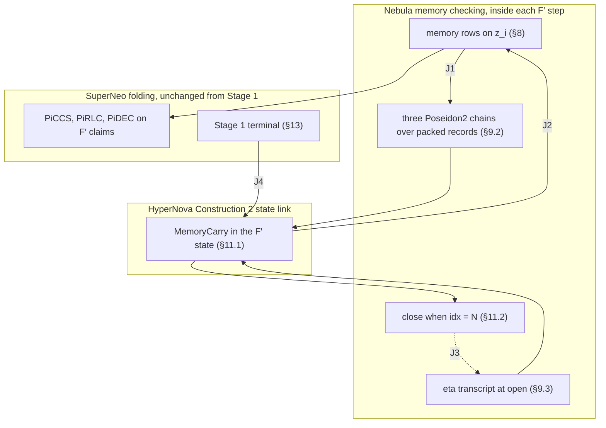

# Nebula memory phase on SuperNeo F′ — protocol specification

Status: **Proposed.** This document is not approved for implementation. The
trunk decisions authorize Stage 1 only. A Stage 2 memory relation needs an
explicit owner decision.

Base revision: `nico/f-prime-constraints-cuda-formal` at `42df46bef`.

Security companion: [`nebula-superneo-security.md`](./nebula-superneo-security.md).
It holds the security goal, the assumptions, the lemmas, and the error bound.
This file holds the protocol only.

On acceptance, this pair replaces the August V2 draft set
(`docs/Nebula-on-Superneo/`) and the historical `specs/` files on
`nico/nebula-m0-frontend`.

The key words **MUST**, **MUST NOT**, and **MAY** state requirements.

## 1. Scope

This specification adds one Nebula memory phase to the Stage 1 F′ system, as
`FPRIME_LEAN_ARCHITECTURE_SPEC.md` §6 requires. The phase supplies:

- public ROM and RAM in one flat address space;
- fixed application memory ports;
- segmented offline memory checking with public-coin fingerprints;
- a memory carry in the F′ state;
- terminal memory acceptance and a final memory root.

An accepting proof attests one execution of the verifier-selected application
relation. The execution starts from the statement's initial application state
and the plan's initial memory. It ends in the statement's final application
state. Every memory access goes through a port and is sequentially consistent.

Out of scope: application semantics (for example WASM), stacks, private
initial memory, zero knowledge, more than one checked step per fresh claim, and
more than one fresh claim per fold.

### 1.1 Overview (informative)

This subsection explains how the phase joins the Stage 1 stack. The rules are
in §6–§13.

Three layers keep their own protocols:

- **SuperNeo** folds the F′ claims exactly as in Stage 1. The memory phase adds
  no commitment component, no claim, and no evaluation (§7).
- **HyperNova Construction 2** links each invocation to the next through the
  hash of the F′ state. The memory carry (§11) is a new block of that state.
- **Nebula** checks memory with fingerprints of four multisets (§8). Each step
  adds its own records to three Poseidon2 chains (§9.2), as in the hash-chain
  commitment of Nebula §3.1. Each segment closes with the checks of Nebula's
  `F_final` (§11.2).

The layers meet at four joints:

| Joint | Mechanism | Spec |
|---|---|---|
| J1 | Each step packs its own records and adds them to three Poseidon2 chains. | §6.3, §9.1, §9.2, §11.2 |
| J2 | The memory rows read `η`, `h`, `ts`, and `idx` from the authenticated carry and write the new values back. | §8, §11.1 |
| J3 | The proposed roots and `D_mem` enter the `η` transcript. The close checks that the chains equal them. | §9.3, §11.2 |
| J4 | The Stage 1 terminal checks the last claim and its state link. The verifier then requires a closed carry. | §12, §13 |

One segment runs in four stages:

1. **Open.** The prover proposes the ops root and the FS root. The relation
   derives `η` from them, `D_mem`, `ts`, and `plan_digest`. To compute the
   roots, the prover must first run the whole segment natively.
2. **Step.** Each invocation runs the memory rows on its own assignment. The
   rows update the four products. The same invocation adds the step's records
   to the chains. SuperNeo then folds the invocation's claim, as in Stage 1.
3. **Close**, in the step that sets `idx = N`. The chains must equal the roots
   that entered `η`, and the product equation must hold. Then `D_mem` takes the
   FS root.
4. **Terminal.** The Stage 1 terminal checks the last claim. The verifier
   requires that the final carry is closed.



Security note §4 gives the argument for each joint and its status.

## 2. Sources and authority

The published papers are the source of truth:

- Nebula: §3 (§3.1 incremental commitments, §3.2, Constructions 1 and 2), §4.2,
  §4.3, Appendix A, in the published text pinned in
  `docs/nebula-paper-original.zip`. The corrected working copy in
  `docs/nebula-paper/` is not the authors' text and is not authority here.
- SuperNeo v1.2 (`docs/superneo-paper-v1_2/`): §5–§8 and Appendix B.
- HyperNova: Construction 2 (§6.3) and Lemma 4.
- Coral: reference material only. This specification requires no Coral
  construction.

`FPRIME_LEAN_ARCHITECTURE_SPEC.md` §2 lists the corrected copies
`docs/nebula-paper/` and `docs/hypernova-paper/`. This specification follows
the owner rule that the published text is the source of truth. It uses a
corrected copy only where that copy adds a premise: the HyperNova Lemma 4
premises (security note A4). It does not use the corrected `F_scan` timestamp
range checks, because security note Lemma 5 shows that they are not needed.
At the base revision, only `docs/superneo-paper-v1_2/` is in git. The other
paper paths are local working-tree copies.

This specification depends on these trunk documents and does not restate
them:

| Trunk document | What this specification uses |
|---|---|
| `FPRIME_LEAN_ARCHITECTURE_SPEC.md` §3, §4, §5, §6 | Stage 1 profile, authority model, lifecycle, Stage 2 phase rule |
| `decisions/padded-row-identity-piccs.md` | One-joint PiCCS; no column challenge, `s_col`, or `y_zcol` |
| `decisions/piccs-prior-state-digest.md` | PiCCS absorbs the prior-state digest, then the fresh statement |
| `decisions/fprime-stage1-main-ajtai-setup.md` | `κ = 22`, main seed, wide reduction |
| `decisions/fprime-ajtai-shake128-setup.md` | SHAKE128 key expander |
| `decisions/fprime-stage1-domain-2p28.md` | `2^28` joint row and carrier domain |
| `decisions/fprime-stage1-per-application-packages.md` | Verifier-owned application package |

If this specification and a trunk decision disagree, the trunk decision is
authority until this specification is amended.

Lean is the authority for logical builders, physical layout, and transcript
framing, as `FPRIME_LEAN_ARCHITECTURE_SPEC.md` §4 states. This specification
fixes the logical content and order. It does not fix column numbers.

## 3. Inherited base profile

| Symbol | Value | Source |
|---|---|---|
| `q` | `2^64 − 2^32 + 1` | Stage 1 profile |
| `F` | `GF(q)` | Stage 1 profile |
| `𝕂` | `F[U]/(U² − 7)`, `|𝕂| = q²` | `neo_math::K`; field facts in the security note A5 |
| `R_F` | `F[X]/(X^54 + X^27 + 1)`, `d = 54` | Stage 1 profile |
| `b`, `k_ρ`, `B` | `2`, `16`, `2^16` | `CLAUDE.md` policy; architecture spec §3 |
| fold arity | 1 fresh + 16 running = 17 PiRLC inputs | architecture spec §3 |
| PiDEC children | 16 | architecture spec §3 |
| CCS matrices | 7 | architecture spec §3 |
| `κ` | 22; one main commitment is `κ·d = 1,188` field words | main Ajtai setup decision |
| key expander | SHAKE128, `nightstream-ajtai-shake128-wide256-v1` | SHAKE128 decision |
| row domain | `2^28` | domain decision |
| `H` | Poseidon2, width 16, rate 12, capacity 4, digest 4 | `neo-params::poseidon2_goldilocks` |

A digest is four canonical field elements. Every digest and challenge in this
document uses `H` through the trunk v1.1 transcript primitives (`reset_v1_1`,
`absorb_block_v1_1`, `squeeze_digest_v1_1`, `squeeze_extension_v1_1`).

`α` and `γ` always mean the PiCCS challenges, and `ρ` always means the PiRLC
challenges. The memory challenges are `η`.

## 4. Verifier-owned memory plan

### 4.1 Plan fields

The verifier key binds one `NebulaPlan`:

| Field | Meaning |
|---|---|
| `r`, `μ` | ROM has `R = 2^r` cells; RAM has `M = 2^μ` cells |
| `W_ts` | timestamp width in bits |
| `B_ops` | operation slots per step |
| `B_scan` | scan slots per step |
| `N` | steps per segment |
| `S_max` | maximum segments per proof |
| `rom_image` | `R` words of 32 bits |
| `ram_image` | `M` words of 32 bits |

A cell value is one 32-bit word. A proof has at most `S_max · N` steps. This
is the fixed iteration bound of HyperNova Lemma 4 for this verifier key.

### 4.2 Validity rules

Setup MUST reject a plan that breaks any of these rules:

1. **Exact cover:** `N · B_scan = R + M`.
2. **Timestamp range:** `S_max · N · B_ops < 2^W_ts`.
3. **Field encoding:** `W_ts ≤ 62`. Then every timestamp and value is an
   integer below `q`, its field encoding is injective, and row O4 (§8.1)
   cannot wrap modulo `q`.
4. **Address width:** `r ≤ μ` and `R + M < q`. The address field has `μ` bits,
   and every global index is below `R + M`. Only ROM addresses need a range
   gate (§8.1, O6).
5. **Positive sizes:** `B_ops, B_scan, N, S_max ≥ 1`.
6. **Security:** the plan passes the setup check in the security note §5.

The counter widths follow from the plan:

```text
W_step = ⌈log2(N + 1)⌉        holds idx in [0, N]
W_seg  = ⌈log2(S_max + 1)⌉    holds seg_idx in [0, S_max]
W_cnt  = ⌈log2(B_ops + 1)⌉    holds cnt in [0, B_ops]
```

An implementation MUST derive these widths. It MUST NOT use fixed widths.

### 4.3 Plan digest

```text
plan_digest = Digest("Nightstream/Nebula/v3/plan",
                     [r, μ, W_ts, B_ops, B_scan, N, S_max],
                     rom_image, ram_image)
```

Each integer and each image word enters as one canonical field element. The
verifier computes `plan_digest`. A prover-supplied value is invalid.

The verifier-context description of `decisions/piccs-prior-state-digest.md`
MUST include `plan_digest` and `D_init` (§9.2). Both are package constants:
the package rows fix them, as they fix the Stage 1 verifier-context digest.
The relation MUST read them as constants. A witness copy of either value is
invalid, because it would let the prover choose the initial memory.

## 5. Memory model

The global index of a cell is:

```text
g(ROM, a) = a,        0 ≤ a < R
g(RAM, a) = R + a,    0 ≤ a < M
```

Each cell has a state `(v, t)`: a value and the timestamp of its last access.
At chain start, ROM cells hold `rom_image`, RAM cells hold `ram_image`, and
every timestamp is zero.

`ts` is the global timestamp: the number of active operations so far. It never
resets. Each active operation on a cell with old state `(v, rt)` does this:

```text
read(space, a):          RS ← (rt, g, v)      WS ← (ts+1, g, v)      cell ← (v, ts+1)
write(RAM, a, v_new):    RS ← (rt, g, v)      WS ← (ts+1, g, v_new)  cell ← (v_new, ts+1)
```

A write to ROM is invalid. At segment open, `IS` holds one tuple `(t, g, v)`
for every cell. At segment close, `FS` holds one tuple for every cell. For an
honest segment, `IS ∪ WS = RS ∪ FS` holds as multisets.

## 6. Records and lanes

### 6.1 Operation slot

An operation slot has these fields, in this order:

| Field | Bits | Meaning |
|---|---|---|
| `pad` | 1 | `1` = inactive slot |
| `is_write` | 1 | `0` = read, `1` = write |
| `is_ram` | 1 | `0` = ROM, `1` = RAM |
| `addr` | `μ` | address inside the namespace |
| `v_r` | 32 | value read (for a write: the old value) |
| `v_w` | 32 | value written back (for a read: equal to `v_r`) |
| `rt` | `W_ts` | timestamp of the previous access to the cell |

An inactive slot has every other field equal to zero. Inactive slots MAY
appear at any position, because application ports have fixed positions (§10).
Active slots keep their physical position.

For slot `j` of a step with incoming timestamp `ts`:

```text
cnt_j = Σ_{i ≤ j} (1 − pad_i)                (active count in slot order)
wt_j  = ts + cnt_j                           (write timestamp)
g_j   = addr_j + is_ram_j · R
RS_j  = (rt_j, g_j, v_r_j)                   for an active slot
WS_j  = (wt_j, g_j, v_w_j)                   for an active slot
```

### 6.2 Scan slot

A scan slot has `(v: 32 bits, t: W_ts bits)`. Each step has an initial-snapshot
(IS) chunk and a final-snapshot (FS) chunk of `B_scan` slots each. Slot `j` of
step `idx` describes the cell `g = idx · B_scan + j`. This index is structural.
The relation computes it from `idx` and the slot constant. Exact cover gives
one IS tuple and one FS tuple for every cell in every segment. There are no
scan pads.

### 6.3 Lanes

Three fixed column ranges of the step assignment `z` hold the records:

```text
ops lane: the B_ops operation slots
IS lane:  the B_scan IS slots
FS lane:  the B_scan FS slots
```

Encoding: slot-major, then field order, then little-endian bits. One
coordinate holds one bit. Rows O1 and S1 (§8) make every lane coordinate a bit.
The plan fixes the length of each lane:

```text
len_ops = B_ops · (3 + μ + 64 + W_ts)
len_is  = len_fs = B_scan · (32 + W_ts)
```

The IS and FS lanes MUST have the same width and the same encoding. Segment
continuity (§9.2) depends on this.

### 6.4 Hash residency

A fingerprint factor (§8.2) has tuple content `(t, g, v)` and, for an operation
slot, a pad gate. The relation MUST derive the tuple content and the gate only
from:

1. lane coordinates of the same step, which the step hashes (§9.2);
2. the carry fields `ts` and `idx` that the step reads (§8), and structural
   constants;
3. the counter values `cnt_j`, which the counter rows (O2) fix as functions of
   lane coordinates.

The challenges `η` and the product values MUST appear only as fingerprint
coefficients and accumulators. The relation compiler MUST check this column
dependency statically and MUST reject a relation that breaks it. A tuple input
that the step does not hash, or that depends on `η`, lets a prover choose
memory content after the challenge.

## 7. Interface with Stage 1

The memory phase adds rows to the F′ step relation (§8, §9.2) and one block to
the F′ state (§11.1). It adds no commitment component, no claim, and no
evaluation. SuperNeo runs with the Stage 1 commitment map. PiCCS, PiRLC, PiDEC,
the rules of `decisions/piccs-prior-state-digest.md`, and the Stage 1 terminal
openings do not change.

The new state block changes the state preimage, in every invocation and at the
terminal. The proof envelope MUST carry the final carry, so that the terminal
can recompute the state hash (§12). So the extended system needs the new
composition, fixed-point, and domain theorems that
`FPRIME_LEAN_ARCHITECTURE_SPEC.md` §6 requires.

## 8. Per-step memory relation

Each invocation runs one step (§12). The step evaluates these rows on the
invocation's own assignment `z`. The rows read the carry fields `η`, `h`,
`ts`, and `idx` after the invocation's `open` action, if any (§11.2). The rows
write the new `h`, `ts`, and `idx` into the output carry. The same step adds
its records to the chains (§9.2).

### 8.1 Operation rows

For each operation slot `j`:

| # | Constraint |
|---|---|
| O1 | every lane coordinate and auxiliary bit is in `{0, 1}` |
| O2 | `cnt_j = cnt_{j−1} + (1 − pad_j)`, with `cnt_{−1} = 0`, as a `W_cnt`-bit word |
| O3 | `(1 − is_write_j) · (v_w_j − v_r_j) = 0` |
| O4 | `(1 − pad_j) · (wt_j − rt_j − 1 − diff_j) = 0`, where `diff_j` is a `W_ts`-bit auxiliary word |
| O5 | `is_write_j · (1 − is_ram_j) = 0` |
| O6 | `(1 − is_ram_j) · addr_bit_{j,k} = 0` for each `k ∈ [r, μ)` |
| O7 | `pad_j · w = 0` for each word `w ∈ {is_write, is_ram, addr, v_r, v_w, rt}` |
| O8 | `h_rs_j = h_rs_{j−1} · (pad_j + (1 − pad_j) · f_η(RS_j))` |
| O9 | `h_ws_j = h_ws_{j−1} · (pad_j + (1 − pad_j) · f_η(WS_j))` |

O4 is an integer relation because `diff_j` is range-checked and §4.2 rule 3
keeps every term below `2^62`. It gives `rt_j < wt_j`. Each chain `h_*_{−1}`
starts from the carry value `h`.

### 8.2 Fingerprint

```text
f_η(t, g, v) = g + η1 · v + η1² · t − η2      in 𝕂
```

This is the `Hash` function of Nebula §4.3, with the address `a` replaced by
the global index `g`. The challenges are in `𝕂`, not in `F` (§15).

### 8.3 Scan rows

For each scan slot `j` with `g_p = idx · B_scan + j`:

| # | Constraint |
|---|---|
| S1 | every IS and FS coordinate and auxiliary bit is in `{0, 1}` |
| S2 | `h_is_j = h_is_{j−1} · f_η(t^IS_j, g_p, v^IS_j)` |
| S3 | `h_fs_j = h_fs_{j−1} · f_η(t^FS_j, g_p, v^FS_j)` |

### 8.4 Boundary rows

```text
out.ts  = ts + cnt_{B_ops−1},     out.ts < 2^W_ts
out.h   = the last value of each product chain
out.idx = idx + 1
```

## 9. Record chains and memory challenges

### 9.1 Digest primitive and packing

```text
Digest(tag, block_1, …, block_n):
  tr ← reset_v1_1()
  absorb_block_v1_1(tr, tag as field words, one per ASCII byte)
  for each block: absorb_block_v1_1(tr, block)
  return squeeze_digest_v1_1(tr)
```

`pack_l(z)` turns lane `l` of the step assignment `z` into field elements. It
splits the lane's bit string (§6.3) into consecutive chunks of 63 bits. Only
the last chunk can be shorter. A chunk with bits `b_0 … b_62` becomes the field
element `Σ_k 2^k · b_k`. So every packed element is an integer below
`2^63 < q`, and `pack_l` is injective on bit strings of the plan's length
(security note Lemma 1).

A packing that puts more than 63 bits into one element is invalid. For
example, `v · 2^32 + t` with 32-bit `v` and `t` can exceed `q`, so two
different tuples can give the same field element.

### 9.2 Chains

```text
chain_ops(j, D, P) = Digest("Nightstream/Nebula/v3/chain-ops", [j, D], P)
chain_mem(j, D, P) = Digest("Nightstream/Nebula/v3/chain-mem", [j, D], P)
header_ops         = Digest("Nightstream/Nebula/v3/header-ops", [plan_digest])
header_mem         = Digest("Nightstream/Nebula/v3/header-mem", [plan_digest])
```

A lane chain over the steps `0 … N−1` of one segment is

```text
D[0] = header_l,   D[j+1] = chain_l(j, D[j], pack_l(z_j)),   root = D[N]
```

where `z_j` is the assignment of step `j` of the segment, with `l = ops` for
the ops lane and `l = mem` for both the IS and the FS lane. This is the hash
chain `C_{i+1} ← H(C_i, ω_i)` of Nebula §3.1, with a domain tag, the step
index, and a header added. The F′ relation computes it, as in Nebula §3.2. The
IS and FS chains MUST use the same formulas. Then the FS root of segment `k`
equals the IS root of segment `k + 1` when the snapshots are equal.

`D_init` is the IS root over the initial snapshot: for each step `j`, the IS
slots of the cells `j · B_scan … (j+1) · B_scan − 1` with the image values and
`t = 0`. The verifier computes `D_init` at setup. It is part of the verifier
context (§4.3).

### 9.3 Challenge transcript

At segment open, the prover proposes the ops root `D_pre.ops` and the FS root
`D_pre.fs` of the segment. The IS root of the segment MUST be `D_mem`: the FS
root of the previous segment, or `D_init`. The relation derives the
challenges:

```text
tr ← reset_v1_1()
absorb_block_v1_1(tr, "Nightstream/Nebula/v3/eta" as field words)
absorb_block_v1_1(tr, [plan_digest])
absorb_block_v1_1(tr, [ts])
absorb_block_v1_1(tr, [D_pre.ops, D_mem, D_pre.fs])
η1 ← squeeze_extension_v1_1(tr)
η2 ← squeeze_extension_v1_1(tr)
```

These inputs fix every tuple of the segment's four multisets. The three roots
fix the records (security note Lemma 2). `ts` fixes the write timestamps.
`plan_digest` fixes the tuple layout. `D_mem` MUST be absorbed: without it, a
prover could learn `η` first and then choose the previous segment's final
snapshot. The proposals get authority only from the close check (§11.2).

## 10. Application memory ports

The application relation and the operation lane share fixed physical port
positions. For each port, the application relation MUST constrain the active
flag, the read or write mode, the namespace, the address, the value returned to
the application, and the value that a write requests. The operation slot at
the same position MUST equal those values.

Every semantic memory access of the application MUST use one port. No other
memory path is allowed. An inactive port maps to a canonical pad slot. The
verifier key binds the port table.

**Idle step.** A segment has exactly `N` steps, because exact cover needs all
of them. The application relation MUST accept an idle step: every port is
inactive and the application state does not change. An idle step MAY occur at
any step. The prover uses idle steps to fill the last segment. The iteration
count `T` includes them.

## 11. Memory carry

### 11.1 MemoryCarry

The F′ state holds one memory carry:

```text
MemoryCarry {
  seg_idx:  W_seg bits       // segments closed so far
  idx:      W_step bits      // steps run in the current segment
  ts:       W_ts bits        // global timestamp; never resets
  η1, η2:   𝕂                // challenges of the current segment
  h[4]:     𝕂                // running products (rs, ws, is, fs)
  D_pre:    2 digests        // proposed ops and FS roots of the current segment
  D_seen:   3 digests        // chains over the current segment's records (ops, is, fs)
  D_mem:    digest           // FS root of the last closed segment, or D_init
}
```

Between invocations, `1 ≤ idx ≤ N`. The value `idx = N` means that the segment
is closed: the step that set `idx = N` also ran `close`. Otherwise the segment
is open, and `D_seen` covers its first `idx` steps.

The carry is a new component of the F′ state. Its encoding is one block of the
state preimage: the fields in the order above, each integer as one field
element, each `𝕂` element as `(c0, c1)`, and each digest as four field
elements. The block is in the state-output digest and in the prior-state
digest of `decisions/piccs-prior-state-digest.md`. There is no separate carry
digest. Lean fixes the position of the block.

Chain start: the base invocation starts from `seg_idx = 0`, `ts = 0`, and
`D_mem = D_init`, with `D_init` read as the package constant of §4.3. It sets
the other fields with `open`.

### 11.2 Actions

```text
open(c, D_pre.ops, D_pre.fs):   // proposals from the prover
  require c.seg_idx < S_max
  c.D_pre  ← the proposals
  c.η      ← the §9.3 transcript
  c.h      ← all 1_𝕂
  c.D_seen ← (header_ops, header_mem, header_mem)
  c.idx    ← 0

step(c):                        // the §8 rows on this invocation's assignment z
  c.D_seen.ops ← chain_ops(c.idx, c.D_seen.ops, pack_ops(z))
  c.D_seen.is  ← chain_mem(c.idx, c.D_seen.is,  pack_is(z))
  c.D_seen.fs  ← chain_mem(c.idx, c.D_seen.fs,  pack_fs(z))
  c.ts, c.h    ← the §8.4 outputs
  c.idx        ← c.idx + 1

close(c):                       // exactly when step has set c.idx = N
  require c.D_seen.ops = c.D_pre.ops
  require c.D_seen.is  = c.D_mem                         (memory continuity)
  require c.D_seen.fs  = c.D_pre.fs
  require c.h.is · c.h.ws = c.h.rs · c.h.fs
  c.D_mem   ← c.D_pre.fs
  c.seg_idx ← c.seg_idx + 1
```

`step` MUST hash the lane coordinates of the invocation's own assignment, the
same coordinates that the memory rows read. The relation MUST run `close`
exactly when `step` sets `idx = N`. The product equation is a close condition
only. Interior steps carry the products forward.

## 12. Lifecycle

This is HyperNova Construction 2. Each fold has exactly one fresh claim. An
implementation MUST reject any other fold arity for a Nebula verifier key.

Let `S` be the public segment count, `1 ≤ S ≤ S_max`, and `T = S · N`. The
proof has `T` fresh claims `u_0 … u_{T−1}` and `T` invocations
`A[0] … A[T−1]`. Invocation `A[i]` runs step `i` and produces `u_i`. Each
invocation selects exactly one arm from its authenticated input carry `c`:

| Arm | Selected when | Actions |
|---|---|---|
| base | `i = 0` | start the carry; `open`; `step`; `close` if `idx = N` |
| continue | `i ≥ 1` and `c.idx < N` | fold `u_{i−1}`; `step`; `close` if `idx = N` |
| reopen | `i ≥ 1` and `c.idx = N` | fold `u_{i−1}`; `open`; `step`; `close` if `idx = N` |

The prover cannot choose the arm, because `c.idx` comes from the authenticated
input state. "`close` if `idx = N`" is not optional: §11.2 requires it.

**Terminal.** The verifier keeps the Stage 1 terminal check
(`crates/nightstream/src/lifecycle/verify.rs`). It does no extra fold. It opens
the 16 running children and `u_{T−1}` directly and checks the state link of
`u_{T−1}`. The state preimage now holds the carry block, so the proof envelope
carries the final carry, and the verifier recomputes the state hash over it.
Only that hash authenticates the carry fields that are not statement fields.
The final carry is the one that `A[T−1]` wrote after its own `step` and
`close`. The verifier MUST then require `idx = N` in the final carry. A proof
that ends inside a segment fails here.

## 13. Public statement and terminal acceptance

The public statement is the Stage 1 statement (iteration count `T`, initial
application state, final application state) plus three memory fields:

```text
segment_count       S
final_timestamp     ts of the final carry
final_memory_root   D_mem of the final carry
```

The verifier key binds the plan.

For a Nebula verifier key, the verifier MUST reject the Stage 1 initial
envelope (`T = 0`). A proof has at least one segment.

The terminal check MUST:

1. run the Stage 1 terminal check, with the final carry from the envelope in
   the state preimage;
2. require `idx = N` in the final carry;
3. require `1 ≤ S ≤ S_max`, `T = S · N`, and `seg_idx = S`;
4. require every statement field to equal the value in the final state.

`final_memory_root` lets another proof refer to the final memory.

## 14. Rejection and conformance

The native verifier, the recursive relation, and the terminal check MUST
reject the same typed violations. A native check without a matching circuit
equation is a conformance defect.

An implementation conforms only when its tests run through the authoritative
verifier and cover at least these cases:

| Case | Required result |
|---|---|
| Segments with `N ≥ 2`, at production `κ` and production parameters | accept, with continue arms |
| `N = 1`: every invocation opens and closes a segment | accept |
| `S = S_max`, with every counter at its largest value | accept |
| A last segment filled with idle steps | accept |
| Two segments with RAM written in the first and read in the second | accept |
| Fresh memory at a segment boundary | reject at `D_seen.is = D_mem` |
| Segment-0 IS records that differ from the plan images | reject at `D_seen.is = D_mem` |
| A base arm that reads `D_init` or `plan_digest` from the witness | rejected: the relation reads both as package constants (§4.3) |
| Read value differs from the last write | reject at the product equation |
| `rt ≥ wt`; write to ROM; ROM address out of range; nonzero pad | reject at O4; O5; O6; O7 |
| Change one record of a step after its segment opened | reject at a close equality |
| Swap the IS and FS records of one step, when they differ | reject at a close equality |
| A lane coordinate equal to `−1` | reject at O1 or S1 |
| A packing with more than 63 bits in one element | rejected by the packing-layout check (§9.1; security note Ob2) |
| End inside a segment | reject at the terminal `idx = N` check |
| The Stage 1 initial envelope (`T = 0`) with any memory fields | reject (§13) |
| A fold with more than one fresh claim | reject |
| A relation whose tuple inputs read `η` or a coordinate that the step does not hash | rejected by the static residency check (§6.4) |

Each rejection test MUST fail at the named check, not at a host replay.

## 15. Deviations from the papers

| Deviation | Paper | Reason |
|---|---|---|
| One F′ chain. At segment open, the prover proposes the ops and FS roots. The challenges come from these roots, `D_mem`, `plan_digest`, and `ts`. `ts` is absorbed because the write timestamps are computed (`ts + cnt`), not committed. The ops and scan products run in the same invocations as the application steps. The close, in the step that completes the segment, checks the proposals. | Nebula §4.3: Layer 1 proves `F`, then hashes the four carried commitments into `γ`, then proves `F_ops` and `F_scan`. Layer 2 folds the three proofs with `F_final`. | Trunk §6 requires one memory phase that reuses the Stage 1 core. One chain cannot make a second pass over the steps. Security note Lemmas 2 and 3 prove the commit-before-challenge order. The close repeats the `F_final` checks: continuity, challenge binding, product equation, and memory handoff. |
| Fingerprint challenges `(η1, η2)` in `𝕂` | Nebula §4.2–§4.3: one pair `(γ1, γ2)` in `F` | `|F| = 2^64` is too small: the example geometry gives 45.91 bits over `F` and 109.91 bits over `𝕂` (security note §5). |
| The incremental commitment is the §3.1 hash chain over packed records, computed inside F′ by the generic construction at the start of §3.2 | Nebula Constructions 1 and 2 chain commitments to a split-committed witness. §3.2 notes that the generic construction costs in-circuit work linear in the size of the carried data `ω`. | Here `ω` is only the memory records, and this design pays that cost: about 360–370 Poseidon2 permutations per fold at the example geometry. SuperNeo claims and the terminal openings stay unchanged. Separate lane commitments at lane rank 2 would cost about 955 permutations, because all 16 running children would carry them in both state hashes. |
| Fixed segment length `N`, with idle steps (§10) | Nebula §4.3: a segment has as many steps as the proof runs, and the scan has that many chunks | One uniform F′ circuit needs a fixed scan width `B_scan = (R + M)/N`. Idle steps let an execution of any length fill the last segment. |
| ROM and RAM in one flat address space, with O5 (no ROM write) and O6 (ROM address range) | Nebula §4.2: one memory | The scope includes public ROM. The checker runs unchanged over all cells. O5 and O6 only restrict which operations are valid. |

No other protocol change is made to Nebula, SuperNeo, or HyperNova. The
`F_ops` checks (`rt < ts` and `wt = ts`) appear as O4 and the write-timestamp
formula. The `F_scan` address check (`a = a′ = i`) appears as the structural
index. The published `F_scan` has no timestamp range check, and this
specification adds none. The terminal is the Stage 1 terminal, which is the
HyperNova Construction 2 verifier.
