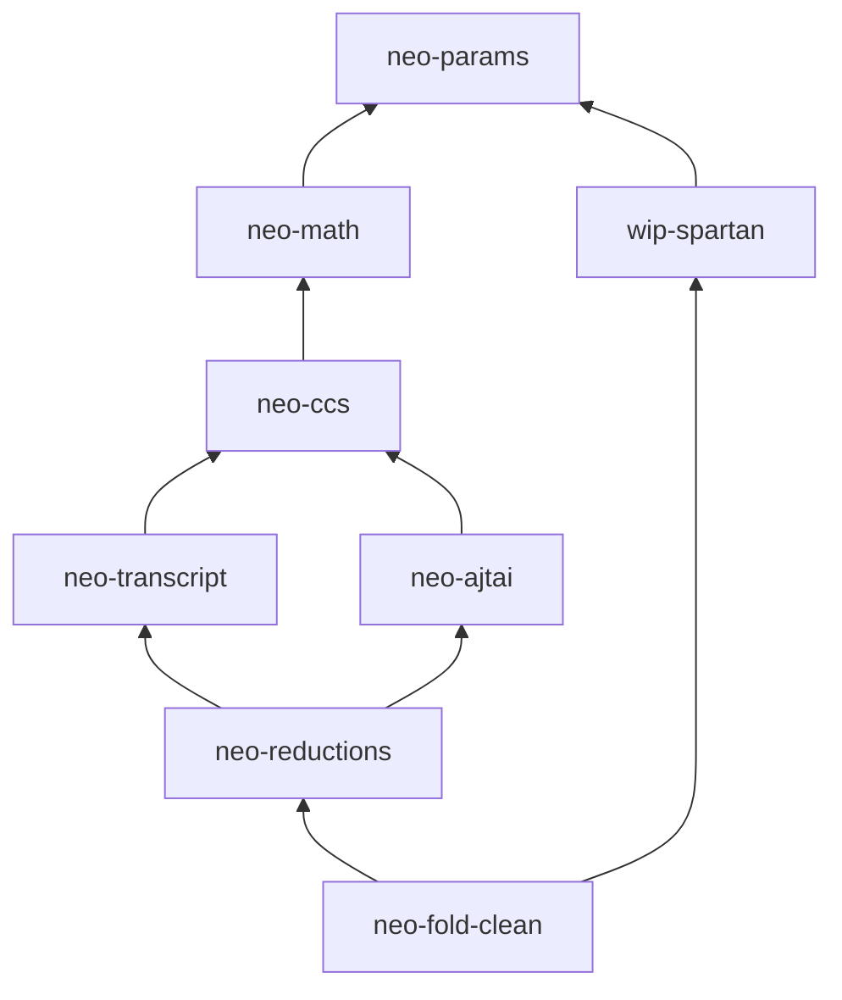

# Architecture

## Core proof dependencies

Arrows point to dependencies. Accelerator and application crates depend on
this core.

## neo-fold-clean ownership

| Area | Ownership |
|---|---|
| `lifecycle/` | Public preprocess, prove, extend, finish, and verify calls |
| `paper/` | Relations, NIFS, Construction 2, F', digests, and decider contract |
| `frontends/` | Direct CCS, recursive R1CS, Nebula, and Bellpepper conversion |
| `engine/` | R1CS builder, protocol gadgets, and full-history audit relation |

The public API uses lifecycle names. Internal state-machine constructors stay
private. `paper/` does not depend on application frontends. Protocol-binding
hashes use Poseidon2.

## Pages

- [Lifecycle](lifecycle.md)
- [Frontends](frontends.md)
- [Terminal proof and decider](decider.md)
