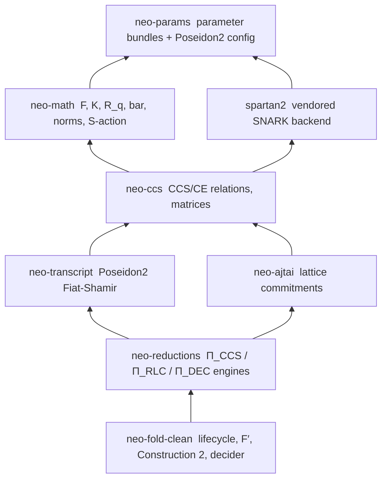

# Architecture

## Workspace layering

Eight crates, strict dependency direction, `neo-fold-clean` on top:



(Arrows point at dependencies; transitive edges omitted.) Per-crate reference:
[Crates](../crates/index.md).

## Inside `neo-fold-clean`

The main crate is organized by *authority*, not by feature. Each layer states what it
owns and what it explicitly does not:

```text
crates/neo-fold-clean/src/
  lifecycle/   The ONLY public surface: preprocess, prove, extend, compress,
               finish_uncompressed*, verify*; FoldSchedule batching.
  paper/       The auditor's home. Paper-named types and protocols, in paper
               order: relations, params, sampling, reductions (Π seams +
               in-circuit verifier gadgets), nifs, construction2, f_prime,
               digest, decider contract, terminal-CE relation.
  frontends/   Translate user computation into foldable CcsInstances:
               direct_ccs (R1CS in), f_prime (encoded-F′ image shell),
               r1cs_f_prime (production F′ frontend), bellpepper (adapter).
  engine/      Implementation backing the paper layer: optimized-engine seam
               to neo-reductions, R1CS-builder gadget primitives, CCS-native
               Poseidon2, Spartan2 decider synthesis. No paper claims here.
```

Rules of the layout (from the module docs, enforced in review):

- **`lifecycle` is the boundary.** Downstream consumers and frontends see lifecycle
  names (`prove`, `extend`, `finish_with_*`, `verify*`) — never internal state-machine
  constructors.
- **`paper` must read like the papers.** Every identifier is a paper symbol or has a
  glossary entry in `paper/mod.rs` mapping it to one. No perf counters, no
  frontend-specific types, no closure plumbing.
- **`engine` carries no protocol authority.** If you trust `neo-reductions`,
  `neo-ccs`, `neo-ajtai`, and `spartan2`, the engine layer's job is only transcript
  discipline and wire-format conversion. Wrappers that do more than split arrays and
  forward arguments are misplaced.
- **Frontends depend on `paper`, never the reverse.** `paper::f_prime` knows no app;
  the F′ image/encoder shell lives in `frontends/f_prime` and app adapters build on it.

## Pages

- [Lifecycle API](lifecycle.md) — the public chain API and its two verifier paths
- [Frontends](frontends.md) — the frontend contract and the soundness boundary
- [Decider](decider.md) — terminal compression: statement, audit R1CS, terminal CE
