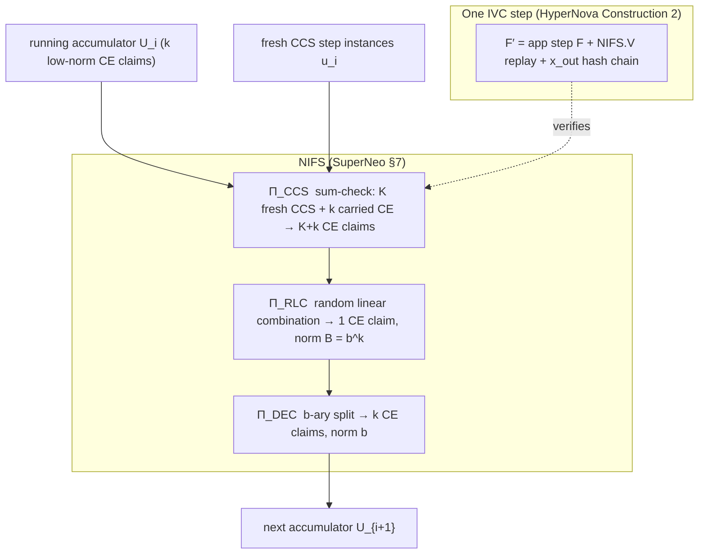

# Protocol Overview

Nightstream composes two papers:

- **SuperNeo** (`docs/superneo-paper/`) supplies the *folding scheme*: a lattice-based
  multi-fold for CCS built from three interactive reductions (Π_CCS, Π_RLC, Π_DEC),
  made non-interactive with a Poseidon2 Fiat-Shamir transcript. This is the `NIFS`
  primitive.
- **HyperNova** (`docs/hypernova-paper/`) supplies the *IVC compiler*: §6.3
  Construction 2 turns any NIVC-compatible folding scheme into incrementally
  verifiable computation via an augmented step function `F′` that re-runs `NIFS.V`.

## Why the composition is not vanilla HyperNova

HyperNova instantiates NIFS with its Constructions 1+3: one sum-check round plus an
RLC, producing **one** linearized output instance over an elliptic-curve (Pedersen)
commitment. Nightstream's lattice setting forces two deviations
(see `crates/neo-fold-clean/src/paper/nifs/mod.rs`):

1. **Π_DEC exists.** Ajtai commitments are binding only for *low-norm* openings.
   Π_RLC's challenge mixing grows witness norm to `B = b^k`, so a third reduction
   decomposes the combined claim back into `k` children of norm `b`. Pedersen
   commitments have no norm, so HyperNova has no such step.
2. **The accumulator is k CE claims, not one.** NIFS.V outputs the Π_DEC children;
   "one running instance" in HyperNova becomes "a fixed-width vector of k CE claims"
   here.

Two further specializations:

- **ℓ = 1**: one step function, `pc = TRIVIAL_PC`. Per-opcode dispatch, where a
  frontend needs it, lives inside that frontend's circuit — not in the IVC layer.
- **Extension-field sum-check**: CCS is over Goldilocks `F_q` (64-bit), too small for
  λ-bit sum-check soundness, so challenges and sum-check run over `K = F_{q²}`,
  with SuperNeo §5's evaluation homomorphism (the `bar` transform) bridging
  ring-committed data and field-level claims.

## Pages

- [SuperNeo folding](superneo-folding.md) — the relations and the three reductions
- [HyperNova IVC](hypernova-ivc.md) — Construction 2, F′, and the state chain
- [Parameters](parameters.md) — the concrete Goldilocks profile and its validity checks
- [Transcript & digests](transcript-and-digests.md) — Fiat-Shamir and digest authority

## Reading order in the papers

For the folding layer: SuperNeo §2 (technical overview), §7 (the scheme), Appendix B
(concrete parameters). For the IVC layer: HyperNova §1.3 (overview), §6.2–6.3
(Construction 2), Appendix B (Fiat-Shamir for folding schemes). SuperNeo §5–6
(embedding, strong/weak reductions) explain why the lattice instantiation is sound.
